## CCILAB内勉強会

2016年3月10日

koturn


## 目次

- カッコいいターミナル環境はいいぞ
    - zshはいいぞ
    - tmuxはいいぞ
    - Vimはいいぞ
- VimでC/C++を書くのはいいぞ
- Vimで遊ぶのはいいぞ


## カッコいいターミナル

- 黒い画面はカッコいい！
- もう一歩先のカッコよさを求めてみないかい？
    - zsh, tmux, Vim という三種の神器


## zshはいいぞ (1)

- みなさんはどんなシェルを使ってる？
- えっ？デフォルトのシェル：bashですか？
- カッコいいシェルを使いませんか？


## zshはいいぞ (2)

- zshのいいところ
    - 右プロンプトカッコいい！
    - 補完候補がカーソルで選択できる！
    - 基本的なコマンドのオプションの補完も可能


## zshはいいぞ (3)

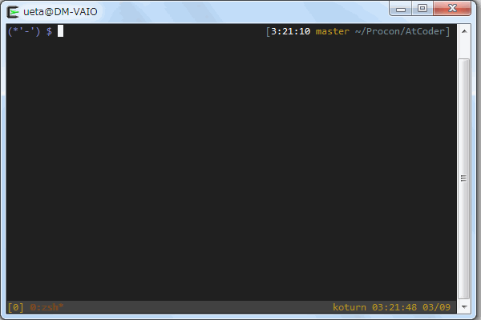


## zshはいいぞ (4)

- ログインシェルをzshにするには
    - `/etc/passwd` を編集する


## tmuxはいいぞ (1)

- 複数のシェルを起動したいとき，どうしていますか？
- え？ターミナルエミュレータを複数起動？
- 画面的にしんどくないですか？
- そこで **tmux**


## tmuxはいいぞ (2)

- ターミナルマルチプレクサと言われるソフトウェア
    - 同種のものに，GNU screenというものがある
- 1つのターミナル上に擬似的なターミナルを複数起動できる
    - ターミナルのウィンドウが散らかること無く，画面をスッキリさせることができる
 画面分割
 複数ウィンドウの生成
- 用語
    - セッション：起動した仮想端末全体
    - ウィンドウ：セッション内の画面（ブラウザのタブみたいなもの）
    - ペイン：ウィンドウを分割した単位


## tmuxはいいぞ (3)

- 基本操作
    - プレフィックスキー `<C-b>` は変更可能

キーバインド  | 機能
--------------|---------------------------------------------------------
 `<C-b><C-c>` | ウィンドウを作成（ブラウザにおける新規タブみたいなもの）
 `<C-b>w`     | ウィンドウ一覧を表示，移動
 `<C-b>&`     | ウィンドウを強制終了
 `<C-b><C-p>` | 前のウィンドウに移動
 `<C-b><C-n>` | 次のウィンドウに移動
 `<C-b>"`     | ペインを横分割
 `<C-b>%`     | ペインを縦分割
 `<C-b>!`     | ペインの分割解除
 `<C-b>o`     | ペイン間移動
 `<C-b>x`     | ペイン間の分割解除
 `<C-b>d`     | セッションのデタッチ（bgコマンド的な．`$ tmux a` でアタッチ）
 `<C-b>[`     | コピーモードの開始（`<Space>` で始点，`<CR>` で終点の選択になり，tmuxのバッファにコピー）
 `<C-b>]`     | コピーしたものを貼り付ける


## tmuxはいいぞ (4)

- 散らかったターミナルエミュレータ

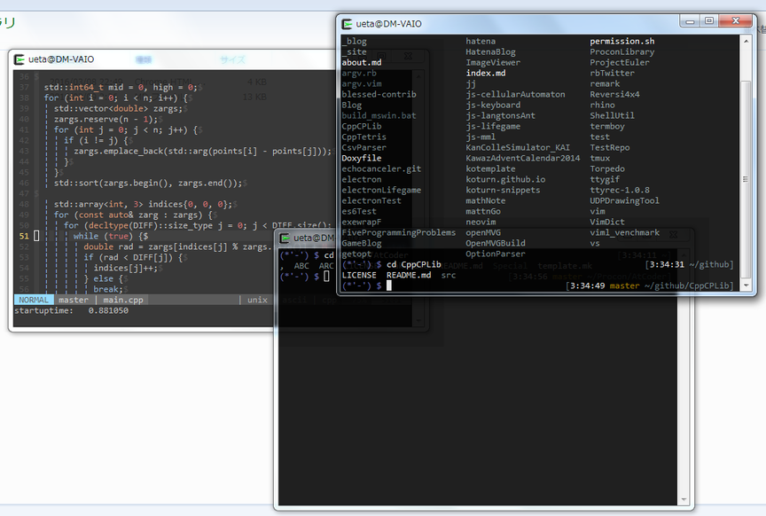


## tmuxはいいぞ (5)

- あんなに散らかっていると，後輩の女の子に罵倒されます


## tmuxはいいぞ (6)

- tmuxで1つのターミナルエミュレータにまとめた

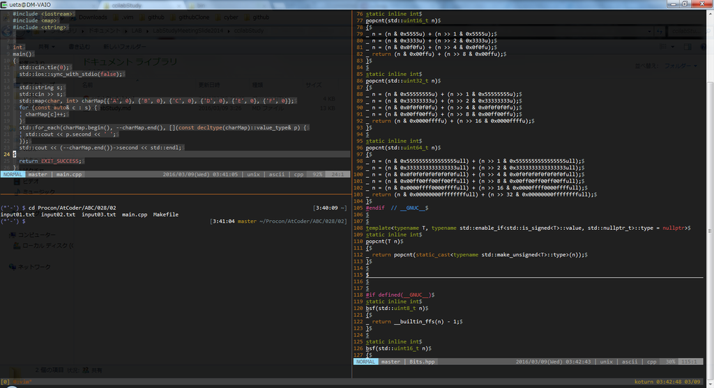


## vimはいいぞ

- 黒い画面でテキストエディタが起動できる
    - 何かカッコいい！
- 軽量かつ高機能
- Vimに関しては後に堀り下げる


## スタバでドヤ顔Macするには

- zsh + tmux + vim でガチャガチャやっていれば．カッコよく見える
    - キーボードとしてHHKBがあれば完璧
- この3種の神器を愛用するエンジニアは多い


## VimでC++を書く

- Vimに偏った話ばかりするのはアレなので，VimでどうやってC++を書くかについて話す
- 基本機能の話とプラグインの紹介を行う
- 以下は既に記述されているものとする

```vim
let g:is_windows =  has('win16') || has('win32') || has('win64')
let g:is_cygwin  =  has('win32unix')
let g:is_mac     = !g:is_windows && (has('mac') || has('macunix') || has('gui_macvim')
      \ || (!isdirectory('/proc') && executable('sw_vers')))
let g:is_unix    =  has('unix')
let s:is_cui     = !has('gui_running')

augroup MyAutoCmd
  autocmd!
augroup END
```


## 基本的な設定 (1)

- インデント周りの設定

オプション  | 意味
------------|-------------------------------------------
`expandtab` | `<Tab>` を入力したとき，スペースを入力する

```vim
set autoindent smartindent
set expandtab smarttab
set shiftwidth=2 tabstop=2 softtabstop=2
set shiftround
set copyindent
augroup MyAutoCmd
  au Filetype c   setlocal cindent cinoptions& cinoptions+=g0,N-s cinkeys-=0#
  au Filetype cpp setlocal cindent cinoptions& cinoptions+=g0,N-s cinkeys-=0#
augroup END
```


## 基本的な設定 (2)

- 文字コードの設定，改行コード
    - OSに依らずutf-8 で LF で統一

```vim
" 'encoding' はVim内部でのエンコーディング
if g:is_windows && s:is_cui
  set encoding=cp932
else
  set encoding=utf-8
endif
scriptencoding utf-8  " これは.vimrc自体のfileencodingと合わせる
" 'fileencoding' は扱うファイルをどういうエンコーディングにするか
" 'termencoding' は通常デフォルトのままにしておくが，Windowsは例外
if g:is_windows
  set fileencoding=utf-8
  set termencoding=cp932
elseif g:is_cygwin
  set encoding=utf-8
  set fileencoding=utf-8
  set termencoding=utf-8
endif
" 以下は自動検出用の設定
set fileformats=dos,unix,mac
if has('guess_encode')
  set fileencodings=guess,utf-16,utf-16le
else
  set fileencodings=iso-2022-jp,ucs-bom,utf-8,euc-jp,cp932,utf-16,utf-16le
endif

" マルチバイト文字を幅2で表示
set ambiwidth=double
```


## 基本的な設定 (3)

- ちょっとしたおせっかい機能

```vim
" 新規ファイルの改行コードをLFにする設定(Window向け)
autocmd MyAutoCmd BufNewFile * set ff=unix
" ファイル保存時に改行コードがLF以外のときに，LFにするかどうか尋ねる設定
autocmd MyAutoCmd BufWritePre *
      \   if &ff !=# 'unix' && input(printf('Convert fileformat:%s to unix? [y/N]', &ff)) =~? '^y\%[es]$'
      \ |   setlocal ff=unix
      \ | endif
```


## Shougo/neobundle.vim

- 前もって，プラグインマネージャーの話をしておく
- 日本のVim界隈で有名なのは [Shougo/neobundle.vim](https://github.com/Shougo/neobundle.vim)
- 設定ファイルの雛型は以下のようになる
- `NeoBundleLazy` しなくても，特定のキーが指定されていれば遅延読み込みを行うようになった

```vim
set runtimepath^=~/.vim/bundle/neobundle.vim/
call neobundle#begin()
let g:neobundle#default_options = {'_': {'verbose': 1}}

if neobundle#load_cache()
NeoBundleFetch 'Shougo/neobundle.vim'

" この間に NeoBundle 'Hoge/fuga' を列挙
" 遅延読み込み，依存関係等の記述はキャッシュされ，起動を高速化できる

NeoBundleSaveCache
endif

" ここにプラグインへの設定（プラグインのグローバル変数への代入）を書く

filetype plugin indent on
```


## オペレータとテキストオブジェクト

- Vimの操作を語る上で外せない
- 領域を選択してヤンクというのはダサい
- オペレータとテキストオブジェクトを使いこなせば，脱初心者


## オペレータ (1)

- `[オペレータ][モーション]` という形で入力
    - `[オペレータ]` は以下の表
    - `[モーション]` はカーソルの移動操作
- 現在のカーソル位置から，移動後のカーソル位置までの範囲のテキストに作用させる
    - `dw`, `yw`, `g?G` など


## オペレータ (2)

- オペレータの一例

オペレータ | 動作
-----------|-----------------------------------------------------------
`c`        | 変更する（消去してインサートモード）
`d`        | 削除する
`y`        | yankする
`~`        | 大文字小文字を入れ替える (‘tildeop’がセットされていれば)
`g~`       | 大文字小文字を入れ替える
`gu`       | 小文字にする
`gU`       | 大文字にする
`!`        | 外部プログラムでフィルターする
`=`        | インデントを整形する
`gq`       | テキストを整形する(幅を80に収めたり)
`g?`       | ROT13で暗号化する
`>`        | 右にインデントする
`<`        | 左にインデントする
`zf`       | foldを定義する
`g@`       |‘operatorfunc’に設定された関数を呼び出す


## オペレータ (3)

- [kana/vim-operator-user](https://github.com/kana/vim-operator-user)を利用して，自分でオペレータを定義可能
- 様々な拡張プラグインがある


## テキストオブジェクト (1)

- `[オペレータ][テキストオブジェクトコマンド]` という形で入力
    - `[オペレータ]` は前述のもの
    - `[テキストオブジェクトコマンド]` は以下の表
- テキストオブジェクトコマンドで指定される範囲にオペレータを作用させる
    - `di(`, `g~w`, `yi'` など


## テキストオブジェクト (2)

- テキストオブジェクトコマンドの一例

テキストオブジェクトコマンド       | 範囲
-----------------------------------|----------------------
`aw`, `iw`                         | 単語(iskeywordに依存)
`aW`, `iW`                         | 単語(空白区切り)
`as`, `is`                         | 文
`ap`, `ip`                         | 段落
`a]`, `a[`, `i]`, `i[`,            | [] 括弧
`a)`, `a(`, `ab`, `i)`, `i(`, `ib` | () 括弧
`a>`, `a<`, `i>`, `i<`             | <> 括弧
`at`, `it`                         | htmlタグ
`a}`, `a{`, `aB`, `i{`, `i}`, `iB` | {} 括弧
`a"`, `i"`                         | ダブルクオート
`a'`, `i'`                         | シングルクオート


## テキストオブジェクト (3)

- [kana/vim-textobj-user](https://github.com/kana/vim-textobj-user)を利用して，自分でテキストオブジェクトを定義可能
- 様々な拡張プラグインがある


## ctagsとは

- ソースコード内にある関数や変数のタグ（インデックス）ファイルを生成するソフトウェア
- タグファイルには定義場所の情報（ファイル名や行数）が記載される
- ctagsの生成したファイルを用いて，ソースコードのジャンプができるソフトウェアも多い
    - Vimも例外ではない


## Vimでctags - 標準機能編 (1)

- まずはタグファイルを作る
    - ルートディレクトリに移動し，以下を実行

```sh
$ ctags -R
```

- Vimからなら，以下のコマンドを実行

```vim
:!ctags -R
```


## Vimでctags - 標準機能編 (2)

- 言語は指定しなくても，ctagsがよしなにやってくれる
- ちゃんと指定したいならば， `--languages` を利用

```sh
$ ctags -R --languages=c++
```

- 詳しいオプションは各自で調べましょう


## Vimでctags - 標準機能編 (3)

- Vimにはどこにタグファイルがあるのかを知らせる必要がある
    - そのためのオプション `tags`
- 以下のように設定すると，親ディレクトリを再帰的に検索してくれる（末尾の `;` がポイント）

```vim
set tags=./tags;
```


## Vimでctags - 標準機能編 (4)

- Vimにはタグジャンプを行うためのキーが定義されている

キーバインド | 効果
-------------|-----------------------------------------------------------------------------
`<C-]>`      | カーソル下にある単語へジャンプ
`g<C-]>`     | `<C-]>` とほぼ同じだが，候補が複数ある場合は候補を選択させるプロンプトを表示
`<C-t>`      | ジャンプ先からジャンプ元に戻る


## Vimでctags - 標準機能編 (5)

- コマンドも定義されている

コマンド | 効果
---------|-------------------------------------------------------------------
`:tag`   | タグスタックを1つ上に（`<C-]>` と違い，タグスタックを破壊しない）
`:pop`   | タグスタックを1つ下に（`<C-t>` と同じ）


## Vimでctags - プラグイン編 (1)

- [tsukkee/unite-tag](https://github.com/tsukkee/unite-tag)
    - uniteインタフェースでctagsを検索できる
- インストールは以下
- `:Unite tag` で実行

```vim
NeoBundle 'Shougo/unite.vim', {
      \ 'on_cmd': [
      \   {'name': 'Unite', 'complete': 'customlist,unite#complete_source'},
      \   {'name': 'UniteWithCurrentDir', 'complete': 'customlist,unite#complete_source'},
      \   {'name': 'UniteWithBufferDir', 'complete': 'customlist,unite#complete_source'},
      \   {'name': 'UniteWithProjectDir', 'complete': 'customlist,unite#complete_source'},
      \   {'name': 'UniteWithInputDirectory', 'complete': 'customlist,unite#complete_source'},
      \   {'name': 'UniteWithCursorWord', 'complete': 'customlist,unite#complete_source'},
      \   {'name': 'UniteWithInput', 'complete': 'customlist,unite#complete_source'},
      \   {'name': 'UniteResume', 'complete': 'customlist,unite#complete#buffer_name'},
      \   {'name': 'UniteClose', 'complete': 'customlist,unite#complete#buffer_name'},
      \   {'name': 'UniteNext', 'complete': 'customlist,unite#complete#buffer_name'},
      \   {'name': 'UnitePrevious', 'complete': 'customlist,unite#complete#buffer_name'},
      \   {'name': 'UniteFirst', 'complete': 'customlist,unite#complete#buffer_name'},
      \   {'name': 'UniteLast', 'complete': 'customlist,unite#complete#buffer_name'}
      \ ]
      \}
NeoBundle 'tsukkee/unite-tag', {
      \ 'depends': 'Shougo/unite.vim',
      \ 'on_source': 'unite.vim'
      \}
```


## Vimでctags - プラグイン編 (2)

- デモ

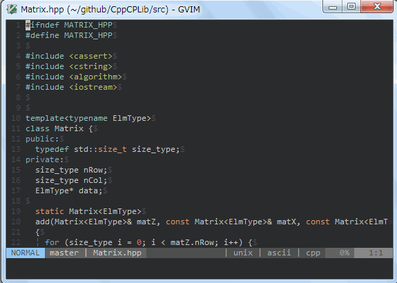


## Vimでctags - プラグイン編 (3)
- [ctrlpvim/ctrlp.vim](https://github.com/ctrlpvim/ctrlp.vim)
    - 本体付属のエクステンションにある `:CtrlPTag`

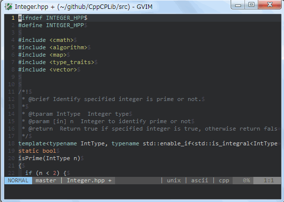


## インデントを可視化する

- インデントを可視化するプラグイン
    - [nathanaelkane/vim-indent-guides](https://github.com/nathanaelkane/vim-indent-guides)
 やや主張しすぎで，個人的には落ち着かない
    - [Yggdroot/indentLine](https://github.com/nathanaelkane/vim-indent-guides)
 控え目な主張
- `listchars` での設定ではタブの可視化しかできない（以下の設定例：`tab:`のところ）
- プラグインではスペースインデントの可視化が可能

```vim
set list
set listchars=eol:$,extends:>,nbsp:%,precedes:<,tab:\|\ ,trail:-
```


## nathanaelkane/vim-indent-guides

- インストールと設定

```vim
NeoBundle 'nathanaelkane/vim-indent-guides'
if neobundle#tap('vim-indent-guides')
  let g:indent_guides_enable_on_vim_startup = 1
  let g:indent_guides_start_level = 1
  let g:indent_guides_guide_size  = 1
  let g:indent_guides_auto_colors = 0
  augroup MyAutoCmd
    au ColorScheme * hi IndentGuidesOdd  ctermbg=darkgreen guibg=#663366
    au ColorScheme * hi IndentGuidesEven ctermbg=darkblue  guibg=#333366
  augroup END
  call neobundle#untap()
endif
```

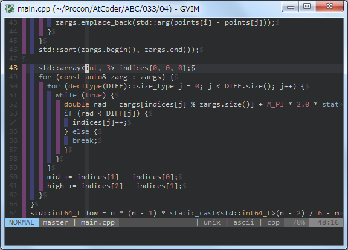


## nathanaelkane/vim-indent-guides

- インストールと設定

```vim
NeoBundle 'Yggdroot/indentLine'
if neobundle#tap('indentLine')
  let g:indentLine_color_term = 111
  let g:indentLine_color_gui = '#008800'
  " 以下は雑にインデントの可視化をすることで高速化を行う設定
  let g:indentLine_faster = 1
  call neobundle#untap()
endif
```

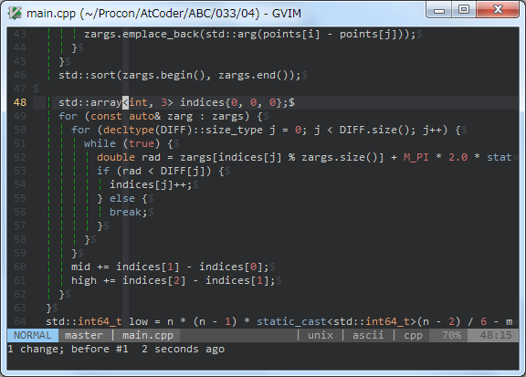


## 選択範囲をコメントアウト

- ビジュアルモードで選択した範囲を一気にコメントアウトできるプラグイン
    - [tyru/caw.vim](https://github.com/tyru/caw.vim)


## tyru/caw.vim

- インストールと設定

```vim
NeoBundle 'tyru/caw.vim', {
      \ 'on_map': [['nv', '<Plug>(caw:']]
      \}
if neobundle#tap('caw.vim')
  nmap <Leader>c  <Plug>(caw:i:toggle)
  xmap <Leader>c  <Plug>(caw:i:toggle)
  call neobundle#untap()
endif
```

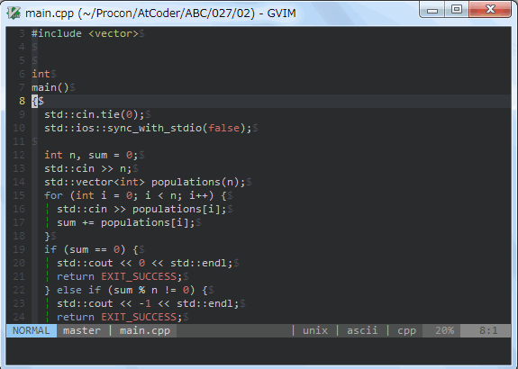


## rhysd/vim-clang-format (1)

- `clang-format` というツールを用いて，ソースコードを整形するツール
    - clangのインストールが必要
- 整形ルールは自分で調製可能


## rhysd/vim-clang-format (2)

- インストールと設定は以下

```vim
NeoBundle 'rhysd/vim-clang-format', {
      \ 'depends': ['kana/vim-operator-user'],
      \ 'on_cmd': ['ClangFormat', 'ClangFormatEchoFormattedCode', 'ClangFormatAutoToggle'],
      \ 'on_map': ['<Plug>(operator-clang-format)']
      \}
if neobundle#tap('vim-clang-format')
  map ,x  <Plug>(operator-clang-format)
  call neobundle#untap()
endif
```


## rhysd/vim-clang-format (3)

- 前述の設定で，ビジュアルモードで整形範囲を指定し，`,x` でソースコードを整形できる

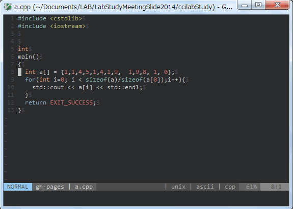


## rhysd/wandbox-vim (1)

- WandboxをVimから利用するプラグイン [rhysd/wandbox-vim](https://github.com/rhysd/wandbox-vim)
    - 手元のソースコードをコンパイルしなくても，実行結果が返ってくる
    - 規格に応じた動作確認に便利


## rhysd/wandbox-vim (2)

### そもそもWandboxとは

- [melpon氏](https://github.com/melpon)により開発されたオンラインコンパイラ
- 多数の言語に対応している
    - 特にC++はgccとclangの多くのバージョンに対応している

```vim
NeoBundle 'rhysd/wandbox-vim', {
      \ 'on_cmd': [
      \   {'name': 'Wandbox', 'complete': 'customlist,wandbox#complete_command'},
      \   {'name': 'WandboxAsync', 'complete': 'customlist,wandbox#complete_command'},
      \   {'name': 'WandboxSync', 'complete': 'customlist,wandbox#complete_command'},
      \   'WandboxOptionList',
      \   'WandboxOptionListAsync',
      \   'WandboxAbortAsyncWorks',
      \   'WandboxOpenBrowser'
      \ ]
      \}
```


## Shougo/neocomplete (1)

- 入力した単語等を補完候補として提示してくれるプラグイン
- 後述する Shougo/neosnippet はこのプラグインに依存している
- インストールは以下

```vim
NeoBundle 'Shougo/neocomplete', {
      \ 'on_i': 1,
      \ 'disabled': (!has('lua') || (v:version < 703 || (v:version == 703 && !has('patch885')))),
      \ 'on_cmd': [
      \   'NeoCompleteEnable',
      \   'NeoCompleteDisable',
      \   'NeoCompleteLock',
      \   'NeoCompleteUnlock',
      \   'NeoCompleteToggle',
      \   {'name': 'NeoCompleteSetFileType', 'complete': 'filetype'},
      \   'NeoCompleteClean',
      \   {'name': 'NeoCompleteBufferMakeCache', 'complete': 'file'},
      \   {'name': 'NeoCompleteDictionaryMakeCache', 'complete': 'customlist,neocomplete#filetype_complete'},
      \   {'name': 'NeoCompleteSyntaxMakeCache', 'complete': 'customlist,neocomplete#filetype_complete'},
      \   'NeoCompleteTagMakeCache'
      \ ]
      \}
```


## Shougo/neocomplete (2)

- 設定は以下

```vim
if neobundle#tap('neocomplete.vim')
  inoremap <expr><CR>  neocomplete#smart_close_popup() . "\<CR>"
  inoremap <expr><CR>  pumvisible() ? neocomplete#smart_close_popup() . "\<CR>" : "\<CR>"
  let g:neocomplete#enable_at_startup = 1
  call neobundle#untap()
endif
```


## Shougo/neosnippet (1)

- スニペット入力が行えるプラグイン
- 自分でスニペットを定義することも可能


## Shougo/neosnippet (2)

- `NeoBundle` ユーザーは以下のようにしてインストール

```vim
NeoBundle 'Shougo/neosnippet', {
      \ 'depends': (has('lua')
      \   && (v:version > 703 || (v:version == 703 && has('patch885'))) ? 'Shougo/neocomplcache' : 'Shougo/neocomplete.vim'),
      \ 'on_i': 1,
      \ 'on_cmd': [
      \   {'name': 'NeoSnippetEdit', 'complete': 'customlist,neosnippet#commands#_edit_complete'},
      \   {'name': 'NeoSnippetMakeCache', 'complete': 'customlist,neosnippet#commands#_filetype_complete'},
      \   {'name': 'NeoSnippetSource', 'complete': 'file'},
      \   'NeoSnippetClearMarkers'
      \ ],
      \ 'on_ft': 'neosnippet',
      \ 'on_map': [['nisx', '<Plug>(neosnippet_']],
      \}
```


## Shougo/neosnippet (3)

- neosnippet の設定は以下

```vim
if neobundle#tap('neosnippet')
  imap <C-k>  <Plug>(neosnippet_expand_or_jump)
  smap <C-k>  <Plug>(neosnippet_expand_or_jump)
  imap <expr><TAB>  neosnippet#expandable() <Bar><Bar> neosnippet#jumpable() ?
        \ "\<Plug>(neosnippet_expand_or_jump)" : pumvisible() ? "\<C-n>" : "\<TAB>"
  smap <expr><TAB>  neosnippet#expandable() <Bar><Bar> neosnippet#jumpable() ?
        \ "\<Plug>(neosnippet_expand_or_jump)" : "\<TAB>"
  " concealは好みで
  if has('conceal')
    set conceallevel=2 concealcursor=i
  endif
  " 以下の変数は自分の定義したスニペットファイルへのディレクトリ
  " 複数のディレクトリを指定したい場合は `;` 区切り，もしくはリストを代入
  let g:neosnippet#snippets_directory = '~/github/koturn-snippets/neosnippets'
  call neobundle#untap()
endif
```


## Shougo/neosnippet (4)

- デフォルトのスニペットを導入する
    - 全て自分で定義するのは面倒
    - デフォルトのスニペットがスニペットファイルを自作する際に参考になる
- `g:neosnippet#snippets_directory` に追加しなくても使える

```vim
NeoBundle 'Shougo/neosnippet-snippets'
```


## Shougo/neosnippet (5)

- 例：`std::sort()` の引数を書くの面倒だー！
    - 全体をソートする場面がほとんどなのに，開始と終了のイテレータを指定するのが面倒
    - 第三引数のラムダの引数が面倒
- そこでneosnippet


## Shougo/neosnippet (6)

```cpp
std::sort(
  hogeVct.begin(),
  hogeVct.end(),
  [](const decltype(hogeVct)::value_type& x, const decltype(hogeVct)::value_type& y) {
    return x.first == y.first ? x.second > y.second : x.first > y.first;
  });
```


## Shougo/neosnippet (7)

- 以下のようなスニペットを定義
    - `${1}`，`${2}`は実際にカーソルを持ってきて入力するところ
    - 使い回したい場合は，2回目以降で `$1`，`$2` とする
    - `${1:int}` のようにすることで，デフォルト値を設定可能
    - `${0:TARGET}` は最終的にカーソルを持ってきたい箇所に記述
 `TARGET` 以外にすると，デフォルト値になるので注意
- これで `sort<C-k>` でスニペット展開できる
    - `<C-k>` の度に `${1}`, `${2}` ... `${0:TARGET}` の順でカーソルが移動する

```cpp
snippet sort
  std::sort(
    ${1}.begin(),
    $1.begin(),
    [](const decltype($1)::value_type& x, const decltype($1)::value_type& y) {
      ${0:TARGET}
    });
```


## Shougo/neosnippet (8)

- neosnippet（とwandbox-vim）のデモ

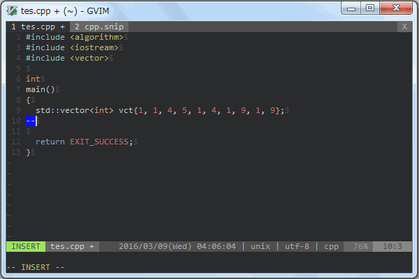


## Shougo/neosnippet (9)

- C++向けスニペット例

```txt
snippet cout
  std::cout << ${0:TARGET} << std::endl;

snippet sfinae
  typename std::enable_if<${0:TARGET}, std::nullptr_t>::type = nullptr

snippet limmax
  std::numeric_limits<${0:int}>::max();

snippet def_gcd
  #ifdef __GNUC__
  #  define gcd(a, b)  __gcd(a, b)
  #else
  template<typename IntType, typename std::enable_if<std::is_integral<IntType>::value, std::nullptr_t>::type = nullptr>
  static IntType
  gcd(IntType a, IntType b)
  {
    IntType r;
    while ((r = a % b) != 0) {
      a = b;
      b = r;
    }
    return a;
  }
  #endif
```


## Shougo/neosnippet (10)

- プログラムのテンプレートをスニペットにしてもよい
- バッククオートで囲った部分は，Vim scriptの式として解釈される

```txt
snippet main
  /*!
   * @brief Template C++-source file
   *
   * This is a template C++-source file
   * @author  koturn
   * @date    `strftime('%Y %m/%d')`
   * @file    `fnamemodify(expand('%'), ':t')`
   * @version 0.1
   */
  #include <cstdlib>
  #include <iostream>

  /*!
   * @brief Entry point of the program
   * @param [in] argc  A number of command-line arguments
   * @param [in] argv  Command line arguments
   * @return  Exit-status
   */
  int
  main(int argc, char *argv[])
  {
    std::cout << "Hello World!" << std::endl;
    ${0:TARGET}
    return EXIT_SUCCESS;
  }
```


## Shougo/neosnippet (11)

- ただし，テンプレート挿入に特化したプラグインがあるので，必ずしもスニペットにする必要は無い
    - [thinca/vim-template](https://github.com/thinca/vim-template)
    - [mattn/sonictemplate-vim](https://github.com/mattn/sonictemplate-vim)
    - [koturn/vim-kotemplate](https://github.com/koturn/vim-kotemplate)
        - [kotemplate用のテンプレートファイル集](https://github.com/koturn/kotemplate)


## thinca/vim-quickrun (1)

- Vimから各種言語をコンパイル，実行するためのプラグイン
- QUickFixにも対応しており便利
- インストールは以下の通り

```vim
NeoBundle 'thinca/vim-quickrun', {
      \ 'on_cmd': {'name': 'QuickRun', 'complete': 'customlist,quickrun#complete'},
      \ 'on_map': [['n', '<Plug>(quickrun']]
      \}
```


## thinca/vim-quickrun (2)

- 基本設定は以下の通り
    - 設定は辞書変数 `g:quickrun_config` に書く
    - 実行は [Shougo/vimproc.vim](https://github.com/Shougo/vimproc.vim)に投げることで非同期に
    - Windowsではシバンを無視すると幸せになれる

```vim
if neobundle#tap('vim-quickrun')
  function! neobundle#tapped.hooks.on_source(bundle) abort
    " オプショナルな依存関係であるため，on_sourceフックでvimproc.vimを読み込む
    if neobundle#is_installed('vimproc.vim')
      call neobundle#source('vimproc.vim')
    endif
    let g:quickrun_config = {
          \ '_': {
          \   'outputter': 'buffer',
          \   'outputter/buffer/split': ':botright',
          \   'runner': 'vimproc',
          \   'outputter/buffer/close_on_empty': 1,
          \   'runner/vimproc/updatetime': 60,
          \   'hook/shebang/enable': !g:is_windows
          \ }
          \}
    nnoremap <expr><silent><C-c> quickrun#is_running() ? quickrun#sweep_sessions() : "\<C-c>"
    nmap <Leader>r  <Plug>(quickrun)
  endfunction
  call neobundle#untap()
endif
```


## thinca/vim-quickrun (3)

- 各種言語の設定を特に行わなくても，デフォルトの設定である程度うまくいく
    - しかし，コンパイラオプションを調製したいこともある
    - 特にワーニング関係のフラグ（`-Wall`, `-Wextra` あたり）

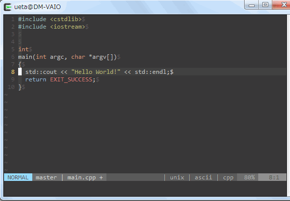


## thinca/vim-quickrun (4)

- 各言語用の設定は `g:quickrun_config` のキー
    - キー名はfiletypeと一致する
- 以下は `-Wall`, `-Wextra` を指定する例
    - ワーニング部分，エラー部分をQuickFixに出力する

```vim
let g:quickrun_config.cpp = {
      \ 'outputter': 'quickfix',
      \ 'command': 'g++',
      \ 'cmdopt': '-Wall -Wextra',
      \ 'exec': '%c %o %s',
      \}
```

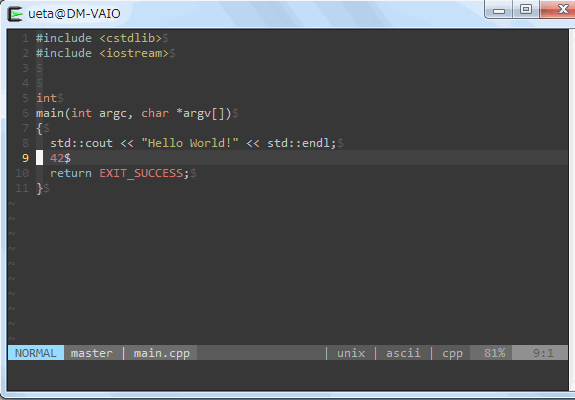


## thinca/vim-quickrun (5)

- vim-quickrun でmakeを実行する
    - QuickFixにより，やはりエラー箇所に移動可能
    - Makefileの `CXXFLAGS` に `-fdiagnostics-color=always` は指定しない方がいいかも...

```vim
let g:quickrun_config.make = {
      \ 'outputter': 'error:buffer:quickfix',
      \ 'command': 'make',
      \ 'exec': '%c %o'
      \}
```


## vim-jp/cpp-vim

- 最近のVim本体のシンタックスハイライトでもC++11対応はしている
- しかし，vim-jpの方が更新頻度は高いのでオススメ

```vim
NeoBundle 'vim-jp/cpp-vim', {
      \ 'on_ft': 'cpp',
      \}
```


## octol/vim-cpp-enhanced-highlight

- C++11/C++14用のシンタックスハイライトを定義したプラグイン
    - `std::enable_if` とかも気を効かせてハイライトしてくれる
- インストールは以下

```vim
NeoBundle 'octol/vim-cpp-enhanced-highlight', {
      \ 'on_ft': 'cpp',
      \}
```


## Vimで遊ぶのはいいぞ

- Vimってこんなことができるよ
    - シェルになる
    - Twitter
    - 音楽聞く
    - ゲーム
- 他にも
    - [英単語を調べることができる](https://github.com/thinca/vim-ref)
    - [天気予報](https://github.com/yuratomo/weather.vim)
    - [テキストブラウザ](https://github.com/yuratomo/w3m.vim)


## シェル（ターミナル）になる

- Vim scriptでシェルを実現したもの，外部のシェルを起動するものがある
    - [Shougo/vimshell.vim](https://github.com/Shougo/vimshell.vim)
    - [vim-scripts/vim-conque](https://github.com/vim-scripts/vim-conque)


## Shougo/vimshell.vim

- Vim scriptでシェルを実装したもの
- [Shougo/vimproc.vim](https://github.com/Shougo/vimproc.vim) を用いて，外部コマンドの結果をポーリングしている
- Vimとの親和性は高い
- zshなどのシェルと比べると，やや不便
- インストールは以下

```vim
NeoBundle 'Shougo/vimshell', {
      \ 'depends': 'Shougo/vimproc.vim',
      \ 'on_cmd': [
      \   {'name': 'VimShell', 'complete': 'customlist,vimshell#complete'},
      \   {'name': 'VimShellCreate', 'complete': 'customlist,vimshell#complete'},
      \   {'name': 'VimShellPop', 'complete': 'customlist,vimshell#complete'},
      \   {'name': 'VimShellTab', 'complete': 'customlist,vimshell#complete'},
      \   {'name': 'VimShellCurrentDir', 'complete': 'customlist,vimshell#complete'},
      \   {'name': 'VimShellBufferDir', 'complete': 'customlist,vimshell#complete'},
      \   {'name': 'VimShellExecute', 'complete': 'customlist,vimshell#helpers#vimshell_execute_complete'},
      \   {'name': 'VimShellInteractive', 'complete': 'customlist,vimshell#helpers#vimshell_execute_complete'},
      \   'VimShellSendString',
      \   {'name': 'VimShellSendBuffer', 'complete': 'buffer'},
      \   'VimShellClose',
      \ ],
      \ 'on_map': [['n', '<Plug>(vimshell_']]
      \}
  call neobundle#untap()
endif
```


## インストール

- 設定は以下

```vim
if neobundle#tap('vimshell')
  let g:vimshell_prompt = "('v ')$ "
  let g:vimshell_secondary_prompt = '> '
  let g:vimshell_user_prompt = 'getcwd()'
  let g:vimshell_right_prompt = '"[" . strftime("%Y/%m/%d %H:%M:%S", localtime()) . "]"'
  call neobundle#untap()
endif
```

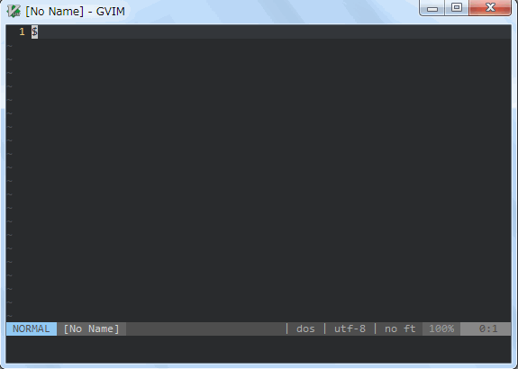


## vim-scripts/vim-conque

- Vimをターミナルエミュレータ代わりにするプラグイン
- zshなどのシェルを使えるのが魅力だが，Vimとの親和性が低い
- インストールと設定は以下

```vim
NeoBundle 'vim-scripts/Conque-Shell', {
      \ 'on_cmd': [
      \   {'name': 'ConqueTerm', 'complete': 'shellcmd'},
      \   {'name': 'ConqueTermSplit', 'complete': 'shellcmd'},
      \   {'name': 'ConqueTermVSplit', 'complete': 'shellcmd'},
      \   {'name': 'ConqueTermTab', 'complete': 'shellcmd'}
      \}
if neobundle#tap('Conque-Shell')
  let g:ConqueTerm_FastMode = 1
  let g:ConqueTerm_ReadUnfocused = 1
  let g:ConqueTerm_InsertOnEnter = 1
  " let g:ConqueTerm_PromptRegex = '^-->'
  " let g:ConqueTerm_TERM = 'xterm'
  call neobundle#untap()
endif
```


## VimでTwitter (1)

- [basyura/TweetVim](https://github.com/basyura/TweetVim)
- インストールは以下

```vim
NeoBundle 'basyura/TweetVim', {
      \ 'depends': ['tyru/open-browser.vim', 'basyura/twibill.vim'],
      \ 'on_cmd': [
      \   'TweetVimAccessToken',
      \   'TweetVimAddAccount',
      \   'TweetVimClearIcon',
      \   'TweetVimCommandSay',
      \   'TweetVimCurrentLineSay',
      \   'TweetVimHomeTimeline',
      \   {'name': 'TweetVimListStatuses', 'complete': 'custom,tweetvim#complete#list'},
      \   'TweetVimMentions',
      \   {'name': 'TweetVimSay', 'complete': 'custom,tweetvim#complete#account'},
      \   {'name': 'TweetVimSearch', 'complete': 'custom,tweetvim#complete#search'},
      \   {'name': 'TweetVimSwitchAccount', 'complete': 'custom,tweetvim#complete#account'},
      \   'TweetVimUserStream',
      \   {'name': 'TweetVimUserTimeline', 'complete': 'custom,tweetvim#complete#screen_name'},
      \   'TweetVimVersion'
      \ ],
      \ 'on_source': 'unite.vim'
      \}
```


## VimでTwitter (2)

- 設定例

```vim
if neobundle#tap('TweetVim')
  let g:tweetvim_original_hi = 1
  let g:tweetvim_tweet_per_page = 50
  let g:tweetvim_display_source = 1
  let g:tweetvim_display_time = 1
  " Imagemagickがインストールされていれば，以下のグローバル変数に1をセットすることでアイコン表示可能
  " let g:tweetvim_display_icon = 1
  call neobundle#untap()
endif
```


## Vimで音楽

- [supermomonga/jazzradio.vim](https://github.com/supermomonga/jazzradio.vim)
    - [jazzradio.com](http://www.jazzradio.com/) のラジオを聞くことができるVim
- [subebe/audio-junkie.vim](https://github.com/subebe/audio-junkie.vim)
    - jazzradio.com以外のストリーミングラジオに対応
- [koturn/vim-mplayer](https://github.com/koturn/vim-mplayer)
    - mplayerの薄いラッパー
    - ローカルの音楽ファイルから，plsファイル等でストリーミングラジオも聴くことができる


## Vimでゲーム

- 色々なゲームができる
    - [katono/rogue.vim](https://github.com/katono/rogue.vim)
    - [thinca/vim-threes](https://github.com/thinca/vim-threes)
- 他にも[色々ある](http://vim-jp.org/blog/2011/09/20/games.html)


## katono/rogue.vim (1)

- Rogue-clone II のVim移植版
- `has('lua')` が `1` になるVimで実行できる
    - `if_lua` を用いることにより，大幅に処理を高速化している
- インストールや設定は以下

```vim
NeoBundle 'rogue.vim', {
      \ 'on_cmd': ['Rogue', 'RogueRestore', 'RogueResume', 'RogueScores']
      \}
if neobundle#tap('rogue.vim')
  let g:rogue#name = 'koturn'
  let g:rogue#japanese = 1
  call neobundle#untap()
endif
```


## katono/rogue.vim (2)

- rogueは「トルネコの大冒険」や「チョコボの不思議のダンジョン」といった不思議のダンジョン系ゲームの大元
- けっこう難しいので，まだクリアできていません


## thinca/vim-threes (1)

- 少し前に流行ったthreesという<del>2048のパクり</del>ゲームのVim実装
- 滑らかなアニメーションで芸が細かい
- インストールと設定は以下

```vim
NeoBundle 'thinca/vim-threes', {
      \ 'on_cmd': ['ThreesStart', 'ThreesShowRecord']
      \}
```

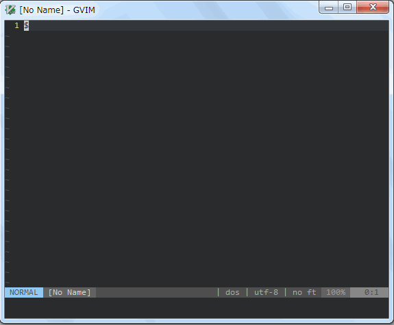


## 与太話 競プロはいいぞ (1)

- 2月の始めから競プロを始めた
- Twitterのフォロワーが100人ぐらい増えた
- 競プロのいいところ
    - アルゴリズムの勉強になる
    - 簡単な問題であっても，競プロを通してC++のSTLが勉強できる
    - 他の人の解答で勉強できる
    - 問題を解いたという達成感を得られる


## 与太話 競プロはいいぞ (2)

- オンラインジャッジ系の競プロ
    - [AtCoder](http://atcoder.jp/)
    - [yukicoder](http://yukicoder.me/)
    - [http://codeforces.com/](http://codeforces.com/)
    - [AOJ](http://judge.u-aizu.ac.jp/onlinejudge/)
- 以下は競プロとは言い難いが，似たようなもの
    - [CodeIQ](https://codeiq.jp/)
    - [paiza](https://paiza.jp/)


## 与太話 GitHubはいいぞ (1)

- どんなゴミであっても，たくさん置いていれば強く見えるらしい
- Web系のインターンに行くことを考えているならば，今の内からアカウントを作って，何か上げておいても損はない

[](https://twitter.com/0918Nobita/status/706845395201105920)


## 与太話 GitHubはいいぞ (2)

- プロからプルリクもらえるかも...？


## 与太話 GitHubはいいぞ (2)

[](https://twitter.com/shirakami_erg/status/705242640820760576)


## 与太話 Twitterはいいぞ (1)

- 強い人をフォローしておくと勉強になる

[](https://twitter.com/progressing7/status/705251813579104256)


## 与太話 Twitterはいいぞ (2)

- わからないこと，気になることをつぶやいておくと，返信してくれる

[](https://twitter.com/koturn/status/706396077000228865)


## 与太話 Twitterはいいぞ (3)

- 教えられることは教える立場になるとよい

[](https://twitter.com/progressing7/status/700630556480962560)


## まとめ (1)

- いいぞいいぞ
    - zsh
    - tmux
    - Vim
- 紹介したVimプラグイン (1)
    - [Shougo/neobundle.vim](https://github.com/Shougo/neobundle.vim)
    - [Shougo/unite.vim](https://github.com/Shougo/unite.vim)
    - [ctrlpvim/ctrlp.vim](https://github.com/ctrlpvim/ctrlp.vim)
    - [tsukkee/unite-tag](https://github.com/tsukkee/unite-tag)
    - [nathanaelkane/vim-indent-guides](https://github.com/nathanaelkane/vim-indent-guides)
    - [Yggdroot/indentLine](https://github.com/nathanaelkane/vim-indent-guides)


## まとめ (2)

- 紹介したVimプラグイン (2)
    - [tyru/caw.vim](https://github.com/tyru/caw.vim)
    - [rhysd/wandbox-vim](https://github.com/rhysd/wandbox-vim)
    - [thinca/vim-template](https://github.com/thinca/vim-template)
    - [mattn/sonictemplate-vim](https://github.com/mattn/sonictemplate-vim)
    - [koturn/vim-kotemplate](https://github.com/koturn/vim-kotemplate)
    - [Shougo/vimshell.vim](https://github.com/Shougo/vimshell.vim)
    - [vim-scripts/vim-conque](https://github.com/vim-scripts/vim-conque)
    - [basyura/TweetVim](https://github.com/basyura/TweetVim)
    - [supermomonga/jazzradio.vim](https://github.com/supermomonga/jazzradio.vim)
    - [subebe/audio-junkie.vim](https://github.com/subebe/audio-junkie.vim)
    - [koturn/vim-mplayer](https://github.com/koturn/vim-mplayer)
    - [katono/rogue.vim](https://github.com/katono/rogue.vim)
    - [thinca/vim-threes](https://github.com/thinca/vim-threes)


## 参考文献

- [view-source:https://www.infiniteloop.co.jp/blog/2011/11/vim-operator/](https://www.infiniteloop.co.jp/blog/2011/11/vim-operator/)
- [Vim Mnemonic | Vim のコマンドの覚え方大全 - haya14busa](http://haya14busa.com/vim-mnemonic/)


## オススメ書籍

- [実践Vim 思考のスピードで編集しよう!](http://www.amazon.co.jp/%E5%AE%9F%E8%B7%B5Vim-%E6%80%9D%E8%80%83%E3%81%AE%E3%82%B9%E3%83%94%E3%83%BC%E3%83%89%E3%81%A7%E7%B7%A8%E9%9B%86%E3%81%97%E3%82%88%E3%81%86-Drew-Neil/dp/4048916599/ref=tmm_pap_title_0)
- [Vim script テクニックバイブル ~Vim使いの魔法の杖](http://www.amazon.co.jp/Vim-script-%E3%83%86%E3%82%AF%E3%83%8B%E3%83%83%E3%82%AF%E3%83%90%E3%82%A4%E3%83%96%E3%83%AB-~Vim%E4%BD%BF%E3%81%84%E3%81%AE%E9%AD%94%E6%B3%95%E3%81%AE%E6%9D%96-script%E3%82%B5%E3%83%9D%E3%83%BC%E3%82%BF%E3%83%BC%E3%82%BA/dp/4774166340/ref=tmm_pap_title_0)
- [改訂新版 C++ポケットリファレンス](http://www.amazon.co.jp/%E6%94%B9%E8%A8%82%E6%96%B0%E7%89%88-C-%E3%83%9D%E3%82%B1%E3%83%83%E3%83%88%E3%83%AA%E3%83%95%E3%82%A1%E3%83%AC%E3%83%B3%E3%82%B9-%E9%AB%98%E6%A9%8B-%E6%99%B6/dp/4774174084/ref=tmm_pap_title_0)
