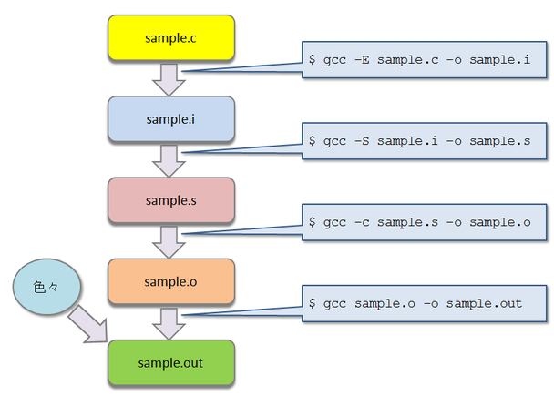

## 第1回
<h1>プログラミング勉強会</h1>

2014年5月15日
担当: koturn


## 目次

- 勉強会の方針
- C/C++について
- gcc/g++の使い方
- cl.exeの使い方
- makeについて


## 目次

- **勉強会の方針**
- C/C++について
- gcc/g++の使い方
- cl.exeの使い方
- makeについて


## 何をするか？(1)

- この勉強会では，プログラミングそのものは扱わない
  - プログラミングそのものは1人で勉強できる
  - 4回生にもなって，授業レベル/新人研修レベルの勉強会をする必要はない
    - 今更，制御文や標準ライブラリの使い方を教わるのは不要のはず
- 実践的な開発に関する話をする


## 何をするか？(2)

- Q. 去年までC/C++のプログラムを作らせていたのに，それでいいのか？
  - A. 宿題でC/C++プログラミングの課題を出します
- Q. どこでC/C++プログラミングの勉強をするのか？
  - A.Programming Place Plus というサイトで勉強してください
    - [http://ppp-lab.sakura.ne.jp/ProgrammingPlacePlus/c/index.html]()
    - [http://ppp-lab.sakura.ne.jp/cpp/language/index.html]()


## 課題に関して

- 統合開発環境(IDE)は使わないこと
  - Visual Studio eclipseなど
  - IDEは単なるコンパイラのフロントエンドに過ぎない
  - 裏で発行されているコマンド，オプションは知っておくべき


## 目次

- ~~勉強会の方針~~
- **C/C++について**
- gcc/g++の使い方
- cl.exeの使い方
- makeについて


## C言語とは
- 1972年に作られたプログラミング言語
- OSや組み込みマシンのプログラムの記述に用いられる
- ネイティブバイナリのプログラムの作成ができる
  - 高速に動作するプログラムの作成


## C++とは
- 1983年に作られたプログラミング言語
- C言語にいろいろな機能をつけた言語
  - マルチパラダイム型のプログラミング言語
- C並に高速なネイティブバイナリのプログラムの作成が可能


## 有名なC/C++コンパイラ

- 以下が有名なC/C++コンパイラである
  - [gcc/g++](http://gcc.gnu.org/)
  - [clang](http://clang.llvm.org/)
  - [Visual Studio](https://www.microsoft.com/ja-jp/dev/default.aspx)
  - [Intel C++ Compiler](https://www.xlsoft.com/jp/products/intel/compilers/)

- 以下は廃れたC/C++コンパイラ
  - [Borland C++](http://www.embarcadero.com/jp/products/cbuilder/free-compiler)
  - [LSI-C](http://www.lsi-j.co.jp/)


## 目次

- ~~勉強会の方針~~
- ~~C/C++について~~
- **gcc/g++の使い方**
- cl.exeの使い方
- makeについて


## コンパイルの流れ(1)

- C言語のコンパイルは以下の手順で行われる


## gcc/g++の使い方(2)

- 具体的には，以下のコマンドを用いる
  - 実際は，gccの裏で別のコマンドが呼び出されている




## 基本オプション

オプション    | 意味
--------------|-----------------------------------
-E            | プリプロセスのみ行う
-S            | コンパイルまで行う
-c            | アセンブルまで行う
-o            | 出力ファイル名を指定する
-I            | インクルードパスを指定する
-L            | ライブラリパスを指定する
-l            | ライブラリを指定する
-g            | gdb用のデバッグ情報を埋め込む
-pipe         | 一時ファイルを作らず，pipeを用いる
-D            | マクロを定義する
-fsyntax-only | 構文解析のみ行い，コンパイルしない


## 最適化オプション(1)

オプション | 意味
-----------|-----------------------------------
-O0        | 最適化しない
-O1        | 少し最適化する
-O2        | そこそこ最適化する
-O3        | かなり最適化する
-Ofast     | 規格違反の挙動を許すレベルで最適化


## 最適化オプション(2)
オプション    | 意味
--------------|-----------------------------------------------
-Os           | バイナリサイズの最適化
-Og           | デバッグ機能を維持しつつ，最適化
-flto         | リンク時の最適化．翻訳単位を超えた最適化が可能
-march=native | コンパイル環境のCPU向けに最適化
-s            | シンボル情報を削除


## ワーニングオプション(1)

オプション    | 意味
--------------|-----------------------------------------
-Wall         | 修正すべき箇所についての警告を表示
-Wextra       | おせっかいな警告も表示
-pedantic     | 後方互換性が無い箇所についての警告を表示


## ワーニングオプション(2)

- 以下は，-Wall, -Wextraでも有効にならない警告オプション
- しかし便利なので，つけるべき

オプション          | 意味
--------------------|-------------------------------------------------------------------------------------
-Wformat=2          | フォーマット文字列のチェックを行う
-Wstrict-aliasing=2 | 型違いのポインタが同じアドレスを指す場合に警告
-Wcast-align        | ターゲットに要求される境界条件が大きくなるようなポインタキャストを警告
-Wcast-qual         | 型修飾子が削除されるポインタキャストを警告
-Wconversion        | 同じ引数が与えられた時に、プロトタイプの有無で，異なった型変換を引き起こす場合に警告


## ワーニングオプション(2)

オプション          | 意味
--------------------|-----------------------------------------------------------------------------
-Wfloat-equal       | 浮動小数点の値を等価比較している場合に警告
-Wpointer-arith     | 関数型やvoidの"サイズ"に依存するものを全て警告
-Wswitch-enum       | switch文のインデックスにおいて列挙型の項目すべてが指定されていない場合に警告
-Wwrite-strings     | const char配列のアドレスをcharポインタで指したときに警告


## 僕がコンパイル時に<br/>つけているオプション

- 長いので，これらはMakefileに書いている

```sh
# アセンブルまで
$ gcc -c -pipe -Ofast -flto -march=native -Wall -Wextra -Wformat=2  \
  -Wstrict-aliasing=2  -Wcast-align -Wcast-qual -Wconversion -Wfloat-equal  \
  -Wpointer-arith -Wswitch-enum -Wwrite-strings -pedantic -o sample.o sample.c
```

```sh
# リンク
$ gcc -s -Ofast -flto -o sample.out sample.c
```


## 目次

- ~~勉強会の方針~~
- ~~C/C++について~~
- ~~gcc/g++の使い方~~
- **cl.exeの使い方**
- makeについて


## cl.exeとは

- Visual StudioのC/C++コンパイラ
- 専用のコマンドプロンプトを起動しないと使えない
  - パスを通すだけではダメ
  - 周辺の環境変数を設定する必要がある


## cl.exeを使用できるようにする

1. スタートボタン
2. すべてのプログラム
3. Microsoft Visual Studio XXXX
4. Visual Studio Tools
5. (ターゲットに合わせたコマンドプロンプトを選択)


## 基本オプション

オプション    | 意味
--------------|-------------------------------
/NOLOGO       | ロゴを表示しない
/P            | プリプロセスのみ行う
/S            | コンパイルまで行う
/FA           | アセンブリコードを出力
/I            | インクルードパスを指定する
/LIBPATH      | ライブラリパスを指定する
/link         | リンクするライブラリを指定する
/D            | マクロを定義する


## 最適化オプション

オプション    | 意味
--------------|-----------------------
/O0           | 最適化しない
/O1           | 少し最適化する
/O2           | そこそこ最適化する
/Os           | バイナリサイズの最適化


## ワーニングオプション

オプション    | 意味
--------------|---------------------
/W1 ~ /W4     | 各レベルで警告を表示
/Wall         | 全ての警告を表示


## 目次

- ~~勉強会の方針~~
- ~~C/C++について~~
- ~~gcc/g++の使い方~~
- ~~cl.exeの使い方~~
- **makeについて**


## makeとは
- ファイル生成の依存関係を考慮して，コマンドを実行するためのもの
  - 依存関係を考慮したシェルスクリプトといえる


## 使用場面
- C/C++のプログラムのビルド
- C/C++以外のプログラムのビルド(Javaなど)
- LaTeXで書かれた論文のビルド


## makeプログラムの種類
- BSD Make
  - オリジナルのmake
- GNU Make
  - 機能拡張されたmake
  - linuxにおける標準的なmake
- nmake
  - MSVCのmake
  - 機能は貧弱

MSVCならnmake，をれ以外ならmakeを想定してよい

Free BSDなどにおいては，makeはBSD makeで，GNU makeがgmakeというコマンド名


## makeファイル(GNU Make向け)の例(1)

```make
CC      := gcc
CFLAGS  := -c -O3 -Wall -Wextra
LDFLAGS := -s -O3
LDLIBS  := -lm

.PHONY: all
all: sample
sample: sample01.o sample02.o
	$(CC) $(LDFLAGS) $(LDLIBS) $< -o $@
sample01.o: sample01.c sample01.h
	$(CC) $(CFLAGS) $< -o $@
sample02.o: sample02.c sample02.h
	$(CC) $(CFLAGS) $< -o $@

.PHONY: clean
clean:
	$(RM) sample.o sample.out
```


## makeファイル(GNU Make向け)の例(2)

- デフォルトのサフィックスルールを用いると...

```make
CC      := gcc
CFLAGS  := -c -O3 -Wall -Wextra
LDFLAGS := -s -O3
LDLIBS  := -lm

.PHONY: all
all: sample

sample: sample01.o sample02.o

sample01.o: sample01.c sample01.h

sample02.o: sample02.c sample02.h

.PHONY: clean
clean:
    $(RM) sample.o sample.out
```


## GNU Makeの使い方

```sh
# カレントディレクトリのMakefileを指定したのと同じ
$ make

# -fオプションで用いるMakefileを指定する
$ make -f myMakefile.mk

# -Cオプションでディレクトリに移動したからmake
$ make -C foo -f myMakefile,mk

# オプション無しでターゲットを指定
$ make clean

# foo=bar で foo = bar とマクロを定義したのと同じ
# 優先度はファイル内のマクロより高い
$ make CC=/bin/gcc
```


## GNU Makeの演算子に関して

演算子 | 意味
-------|--------------------------------------------------
=      | 遅延評価されるマクロを定義
:=     | 右辺をその場で展開し，マクロを定義
?=     | 既に定義されているマクロに対しては再定義を行わない
+=     | 末尾に右辺のテキストを追加


## GNU makeのマクロ(変数)

- 自由に定義できるが，あらかじめ定義されたものもある
- 以下は一例
  - 意味に当てはまるマクロは再定義して用いるべき

定義済みマクロ名 | 意味
-----------------|--------------------------------------
CC               | Cコンパイラ
CXX              | C++コンパイラ
RM               | ファイル消去コマンド
CFLAGS           | C言語のコンパイル時に用いるオプション
CXXFLAGS         | C++のコンパイル時に用いるオプション
LDFLAGS          | リンク時に用いるオプション
LDFLAGS          | 外部ライブラリを指定


## 動的マクロ

- 文脈によって，展開結果が異なるマクロがある
- 汎用性や可読性のために利用すべき
- コマンド部分にしか記述できない

動的マクロ     | 意味
---------------|-----------------------------------------------------------
$@             | ターゲット名に展開
$^             | 依存ファイル全てに展開
$<             | 依存ファイルの内，一番左にあるもの
$?             | 依存ファイルの内，ターゲットよりタイムスタンプが新しいもの


## 架空のターゲット

- 以下のターゲット名はよく用いられる架空のターゲット名である
- 実際に生成するものではないので，.PHONYと共に用いる

架空のターゲット名 | 意味
-------------------|----------------------------------------------
all                | プログラムをビルドする(デフォルト)
check              | プログラムがビルドできたかどうか，チェックする
install            | プログラムのインストールを行う
clean              | ビルドで生成されたファイルを削除する


## サフィックスルールの定義

```make
CC      := gcc
CFLAGS  := -c -O3 -Wall -Wextra
LDFLAGS := -s -O3
LDLIBS  := -lm
# サフィックスルールで用いるサフィックスを登録
.SUFFIXES: .exe .o .c
# .o から .exe を作るルールを定義
.o.exe:
    $(CC) $(LDLIBS) $(LDFLAGS) $^ -o $@
# .c から .exe を作るルールを定義
.c.exe:
    $(CC) $(CFLAGS) $(LDLIBS) $(LDFLAGS) $^ -o $@

sample.exe: sample.o sample.o

sample.o: sample.c sample.h
```


## デフォルトのサフィックスルールについて

- デフォルトのサフィックスルールを使用すると...

```sh
# カレントディレクトリにsample.cがあることを確認
$ ls
sample.c

# 以下は gcc sample.c -o sample と同等
$ make sample
```


## GNU Makeの関数(1)

- Lisp系言語の関数呼び出しに似ている
  - Make 4.00 からSchemeインタプリタGuileとの連携が可能になった
- 非常に協力なものが多数
- GNU Makeがほぼチューリング完全であるのは，この関数群のおかげ


## GNU Makeの関数(2)

- 以下はほんの一部の関数

関数                     | 機能
-------------------------|----------------------------------------------
$(warning arg ...)       | argをコンソールに出力する
$(shell arg ...)         | argをコマンドとして実行する
$(basename arg ...)      | 各引数のサフィックスを除いたリストを返す
$(addprefix sf, arg ...) | 各引数の末尾にsfを加えたリストを返す
$(addsuffix pf, arg ...) | 各引数の先頭にpfを加えたリストを返す


## nmakeについて(1)

- nmakeはGNU makeと比べると非常に貧弱
- 微妙な差異があり，非常に使いづらい
- ググラビリティが低い
  - まともなnmakeの情報はMSのWebサイトぐらい？
    - [NMAKEリファレンス](http://msdn.microsoft.com/ja-jp/library/dd9y37ha.aspx)


## nmakeについて(2)
- 演算子は = しか用い
- 動的マクロの名称がGNU Makeと異なる
- C++コンパイラの定義済みマクロ名はCPPである


## nmakeの動的マクロ

動的マクロ | 意味
-----------|----------------------------------------------------------------------------------------
$@         | ターゲットのフルネーム
$$@        | ターゲットのフルネーム 依存関係の依存ファイルとしてのみ有効
$\*        | ターゲットのパスとベース名
$\*\*      | すべての依存ファイル
$?         | 依存ファイルの内，ターゲットよりタイムスタンプが新しいもの
$<         | 依存ファイルの内，ターゲットよりタイムスタンプが新しいもの 推論規則のコマンドでのみ有効
