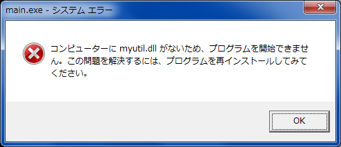
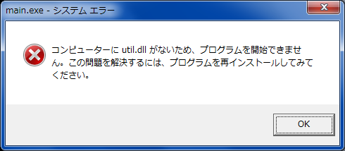

## 第3回
<h1>プログラミング勉強会</h1>

2014年5月29日
担当: koturn


## 目次

- ライブラリの使い方
  - ヘッダファイル
  - スタティックリンクライブラリ
  - 動的リンクライブラリ
- ライブラリの作り方
  - gcc/g++ の場合
  - MSVC の場合
- 実際にライブラリを使ってみる


## ライブラリとは

- 汎用性の高い複数のプログラムを，再利用可能な形でひとまとまりにしたもの
- ライブラリそのものは実行バイナリではない


## ヘッダファイル

- 変数や関数の存在を伝えるもの
- 実体は（普通）記述されていない
- `#include` されると，中身をソースコード内にぶちまける
  - 1つの翻訳単位内に含まれる


## ヘッダファイルのみのライブラリ

- ヘッダファイルに実体は書かない
- しかし，以下のものは書く
  - マクロ定義
  - インライン関数
  - テンプレート関数
  - constexpr関数
- つまり，コンパイル時にコード生成するものは書く
- メタプログラミングの機構の提供
- DSLの提供


## ヘッダファイルのみのライブラリの例

- ヘッダファイルのみのライブラリ例
  - STL
  - Eigen(行列演算ライブラリ)
  - Boost


## スタティックリンクライブラリ

- 関数などの実体がそのまま入っているもの
- 実質はオブジェクトファイルを1つにしたもの


## スタティックリンクライブラリ (2)

- 拡張子
  - Windowsだと.lib
  - それ以外だと.a
- オブジェクトファイルと同様に扱える


## ダイナミックリンクライブラリ (1)

- 実行時に関数本体などの実体を提供するもの
- 部分的なバージョンアップが容易になる
- 実行時の依存関係が生まれてしまう
  - 実行時に見つからないと，プログラムを実行できない
  - 実行バイナリが想定しているバージョンと異なるとうまくいかないことも


## ダイナミックリンクライブラリ (2)

- 拡張子
  - Windowsだと.dll
  - それ以外だと.so
- 実行時にパスが通った場所にあればよい


## gcc: 環境変数

- コンパイル時，実行時に用いられる環境変数
  - ヘッダファイル等を探すのに用いられる

環境変数           | 意味
-------------------|-------------------------------------
C_INCLUDE_PATH     | C ヘッダファイルの検索パス
CPLUS_INCLUDE_PATH | C++ ヘッダファイルの検索パス
LIBRARY_PATH       | コンパイル時のライブラリの検索パス
LD_LIBRARY_PATH    | 動的ライブラリの検索パス


## gcc: コンパイル時

- 以下の環境変数はコンパイル時に用いる
  - C_INCLUDE_PATH
  - CPLUS_INCLUDE_PATH
  - LIBRARY_PATH
- これらを予め設定してからコンパイルするのはあまりよくない
  - 対象の環境変数を汚すため
- コンパイラのオプションで指定すべき
  - 意図せぬ依存関係に気付くことができる


## gcc: 環境変数とオプションの対応

環境変数           | コンパイラのオプション
-------------------|-----------------------
C_INCLUDE_PATH     | -I
CPLUS_INCLUDE_PATH | -I
LIBRARY_PATH       | -L


## cl.exe: 環境変数

- MSVC関係の環境変数は以下の通り

環境変数 | 意味
---------|----------------------------------------------------------
INCLUDE  | C/C++ ヘッダファイルの検索パス
LIBPATH  | コンパイル時のライブラリの検索パス
PATH     | 動的ライブラリの検索パス（実行バイナリの検索パスも兼ねる）


## cl.exe: 環境変数とオプションの対応

- MSVCでもコンパイルオプションでインクルードパス，ライブラリパスを設定するのが
  よい

環境変数 | コンパイラのオプション
---------|-----------------------
INCLUDE  | /I
LIBPATH  | /LIBPATH:


## .h: ヘッダファイル コード例 (1)

- 以下のコードを例に取る

myutil.h

```cpp
#ifndef MYUTIL_H
#define MYUTIL_H

static inline int mypow(int x, int n) {
  int sum = 1;
  for (int i = 0; i < n; i++) {
    sum *=  x;
  }
  return sum;
}

template<typename VType>
static VType mymax(VType a, VType b) {
  return a > b ? a : b;
}

#endif
```


## .h: ヘッダファイル コード例 (2)

main.cpp

```cpp
#include <iostream>
#include "myutil.h"

int main(void) {
  std::cout << mypow(2, 5) << std::endl;
  std::cout << mymax(3, 5) << std::endl;
  std::cout << mymax(4.3, 1.8) << std::endl;
  return 0;
}
```


## コンパイル&実行(g++)

```sh
$ g++ -c main.cpp -o main.o
$ g++ main.o -o main.out
$ ./main.out
32
5
4.3
```


## \#includeについて

- \#includeはヘッダファイルの中身をその場にぶちまけるもの
- 2種類のインクルードがある
  - `#include <foo.h>`
    - インクルードパスにあるヘッダファイルを探す
    - システムやオープンソースライブラリのヘッダファイル
  - `#include "foo.h"`
    - カレントディレクトリにあるヘッダファイルを探す
    - ユーザ定義のヘッダファイル


## ヘッダファイルでのインライン関数の書き方

- 必ずstaticを付けること
  - 非staticだと，コンパイラは外部からのシンボル参照の可能性を排除できない
    - すなわち，シンボルが残り，リンク時に多重定義でエラーになるかもしれない
  - staticであれば，そのソースコード内のみとわかる
    - 関数定義のコード自体が無くなり，コードサイズの削減につながる


## .a: スタティックリンクライブラリ

- gcc/g++ では以下のようにして作成

```sh
$ ar rcs libmylib.a foo.o bar.o baz.o
```


## .a: コード例 (1)

- 以下のコードを例に取る

myutil.h

```c
#ifndef MYUTIL_H
#define MYUTIL_H

int myadd(int a, int b);

#endif
```

myutil.c

```c
#include "myutil.h"

int myadd(int a, int b) {
  return a + b;
}
```


## .a: コード例 (2)

main.c

```c
#include <stdio.h>
#include "myutil.h"

int main(void) {
  printf("myadd(1, 5) = %d\n", myadd(1, 5));
  return 0;
}
```


## .a: コンパイル&実行

```sh
# myutil.cをコンパイル
$ gcc -c myutil.c -o myutil.o

# myutil.oをmylib.aにアーカイブ
$ ar rcs libmylib.a myutil.o

# main.cをコンパイル
$ gcc -c main.c -o main.o

# main.oとmylib.aをリンク
$ gcc main.o -L./ -lmylib -o main.out

# 実行
$ ./main.out
myadd(1, 5) = 6
```


## .lib: スタティックリンクライブラリ

- MSVC では以下のようにして作成

```sh
> lib.exe foo.obj bar.obj baz.obj /OUT:mylib.lib
```


## .lib: コード例

- 先程と同じコードを取り上げる


## .lib: コンパイル&実行

```sh
# myutil.cをコンパイル
> cl.exe /c myutil.c

# myutil.objをmylib.libにアーカイブ
> lib.exe myutil.obj /OUT:mylib.lib

# main.cをコンパイル
> cl.exe /c main.c

# main.oとmylib.aをリンク
> cl.exe main.obj /link mylib.lib

# 実行
> main.exe
myadd(1, 5) = 6
```


## .so: 暗黙的リンク コード例 (1)

- 以下のコードを取り上げる

myutil.h

```c
#ifndef MYUTIL_H
#define MYUTIL_H

int mymax(int a, int b);

#endif
```

myutil.c

```c
#include "myutil.h"

int mymax(int a, int b) {
  return a > b ? a : b;
}
```


## .so: 暗黙的リンク コード例 (2)

main.c

```c
#include <stdio.h>
#include "myutil.h"

int main(void) {
  printf("mymax(1, 5) = %d\n", mymax(1, 5));
  return 0;
}
```


## .so: 暗黙的リンクでコンパイル

```sh
# myutil.cのコンパイル
$ gcc -c myutil.c -o myutil.o

# myutil.soの作成
$ gcc -shared -fPIC myutil.o -o libmyutil.so

# main.cのコンパイル
$ gcc -c main.c -o main.o

# 実行バイナリの作成
$ gcc main.o -L./ -lmyutil -o main.out

# カレントディレクトリを動的ライブラリの検索パスに追加
$ export LD_LIBRARY_PATH=$LD_LIBRARY_PATH:./

# 実行
$ ./main.out
mymax(1, 5) = 5

# libmyutil.soを削除
$ rm libmyutil.so

# 再度実行(.soを消した状態)
$ ./main.out
./main.out: error while loading shared libraries: libmyutil.so: cannot open
shared object file: No such file or directory
```


## .so: 命名ルール

- .soは以下の命名ルールがある
  - これを守らないと，リンクできない
1. 名前の先頭には **lib** を付加する
2. 拡張子は **.so** とする
- 例: **lib** myutil **.so**


## Cygwinの場合

- Cygwinでの命名ルール
  - 先頭に**lib不要**
  - 拡張子は.soではなく**.dll**

```sh
# myutil.cのコンパイル
$ gcc -c myutil.c -o myutil.o

# myutil.soの作成(-fPICが無くても位置独立コードになる)
$ gcc -shared -fPIC myutil.o -o myutil.dll

# main.cのコンパイル
$ gcc -c main.c -o main.o

# 実行バイナリの作成
$ gcc main.o -L./ -lmyutil -o main.exe

# 実行
$ ./main.exe
mymax(1, 5) = 5

# libmyutil.soを削除
$ rm myutil.dll

# 再度実行(.soを消した状態)
$ main.exe
```


## CygwinのDLLエラー




## .so: 明示的リンク コード例 (1)

- 以下のコードは変更しない
  - myutil.c
  - myutil.h
- 以下のコードは変更する
  - main.c


## .so: 明示的リンク コード例 (2)

main.cを以下のように変更

```c
#include <stdio.h>
#include <dlfcn.h>
#include "myutil.h"

#define DL_NAME    ("libmyutil.so")
#define FUNC_NAME  ("mymax")

int main(void) {
  void *dl_handle;
  int  (*mymax_p)(int, int);
  const char *errmsg;

  dl_handle = dlopen(DL_NAME, RTLD_LAZY);
  if ((errmsg = dlerror()) != NULL) {
    fprintf(stderr, "dlopen: %s: %s\n", DL_NAME, errmsg);
    return 1;
  }
  mymax_p = (int (*)(int, int)) dlsym(dl_handle, FUNC_NAME);
  if ((errmsg = dlerror()) != NULL) {
    fprintf(stderr, "dlsym: %s: %s\n", FUNC_NAME, errmsg);
    return 1;
  }

  printf("mymax(1, 5) = %d\n", mymax_p(1, 5));
  dlclose(dl_handle);
  return 0;
}
```


## .so: 明示的リンクでコンパイル

実行バイナリ作成時に，.soの参照が必要ないことに注目！

```sh
# myutil.cのコンパイル
$ gcc -c myutil.c -o myutil.o

# myutil.soの作成
$ gcc -shared -fPIC myutil.o -o libmyutil.so

# main.cのコンパイル
$ gcc -c main.c -o main.o

# 実行バイナリの作成
$ gcc main.o -o main.out

# カレントディレクトリを動的ライブラリの検索パスに追加
$ export LD_LIBRARY_PATH=$LD_LIBRARY_PATH:./

# 実行
$ ./main.out
mymax(1, 5) = 5

# libmyutil.soを削除
$ rm libmyutil.so

# 再度実行(.soを消した状態)
$ main.out
dlopen: myutil.dll: No such file or directory
```


## いじわるをしよう

- C++のコンパイラでコンパイルしたらどうなるか？
  - 名前マングルってあったよね？

今度は関数が見つからない！

```sh
# myutil.cのコンパイル
$ g++ -c myutil.c -o myutil.o

# myutil.soの作成
$ g++ -shared -fPIC myutil.o -o libmyutil.so

# main.cのコンパイル
$ g++ -c main.c -o main.o

# 実行バイナリの作成
$ g++ main.o -o main.out

# カレントディレクトリを動的ライブラリの検索パスに追加
$ export LD_LIBRARY_PATH=$LD_LIBRARY_PATH:./

# 実行
$ ./main.out
lsym: mymax: No such process
```


## 名前マングルを防ぐと？

util.hを以下のように変更

```cpp
#ifndef UTIL_H
#define UTIL_H

#ifdef __cplusplus
extern "C" {
#endif

int mymax(int a, int b);

#ifdef __cplusplus
}
#endif

#endif
```


## 再度コンパイル

今度はうまくいった！

```sh
# myutil.cのコンパイル
$ g++ -c myutil.c -o myutil.o

# myutil.soの作成
$ g++ -shared -fPIC myutil.o -o libmyutil.so

# main.cのコンパイル
$ g++ -c main.c -o main.o

# 実行バイナリの作成
$ g++ main.o -o main.out

# カレントディレクトリを動的ライブラリの検索パスに追加
$ export LD_LIBRARY_PATH=$LD_LIBRARY_PATH:./

# 実行
$ ./main.out
mymax(1, 5) = 5
```


## .dll: 暗黙的リンク コード例 (1)

- 以下，.soの暗黙的リンクのコード例とほぼ同じ
- `__declspec(dllimport)` はDLLに入れる関数を指定

myutil.h

```c
#ifndef MYUTIL_H
#define MYUTIL_H

__declspec(dllimport) int mymax(int a, int b);

#endif
```

myutil.c

```c
#include "myutil.h"

int mymax(int a, int b) {
  return a > b ? a : b;
}
```


## .dll: 暗黙的リンク コード例 (2)

- main.c

```c
#include <stdio.h>
#include "myutil.h"

int main(void) {
  printf("mymax(1, 5) = %d\n", mymax(1, 5));
  return 0;
}
```


## .dll 暗黙的リンクでコンパイル

```sh
# myutil.cのコンパイル
> cl.exe /c myutil.c

# インポートライブラリ(.lib)と.dllを作成
> cl.exe /LD myutil.obj

# main.cのコンパイル
> cl.exe /c main.c

# 実行バイナリを作成(インポートライブラリとリンク)
> cl.exe main.obj /link myutil.lib

# 実行
> main.exe
mymax(1, 5) = 5

# myutil.dllを削除
> del myutil.dll

# 再度実行(.dllを消した状態)
> main.exe
```


## DLLエラー




## .dll: 明示的リンク コード例 (1)

- 以下のコードは変更しない
  - myutil.c
  - myutil.h
- 以下のコードは変更する
  - main.c


## .dll: 明示的リンク コード例 (2)

main.cを以下のように変更

```c
#include <stdio.h>
#include <windows.h>

#define DL_NAME    ("myutil.dll")
#define FUNC_NAME  ("mymax")

int main(void) {
  HINSTANCE hDLL;
  int (*mymax_p)(int, int);

  if ((hDLL = LoadLibrary(DL_NAME)) == NULL) {
    fprintf(stderr, "LoadLibrary: %s is not found\n", DL_NAME);
    return 1;
  }
  if ((mymax_p = (int (*)(int, int)) GetProcAddress(hDLL, FUNC_NAME)) == NULL) {
    fprintf(stderr, "GetProcAddress: function: %s is not found\n", FUNC_NAME);
    return 1;
  }
  printf("mymax(1, 5) = %d\n", mymax_p(1, 5));
  FreeLibrary(hDLL);
  return 0;
}
```


## .dll: 明示的リンクでコンパイル

実行バイナリ作成時に，インポートライブラリ(.lib)の参照が必要ないことに注目！

```sh
# myutil.cをコンパイル
> cl.exe /c myutil.c

# インポートライブラリ(.lib)と.dllを作成
> cl.exe /LD myutil.obj

# main.cをコンパイル
> cl.exe /c main.c

# 実行バイナリを作成
> cl.exe main.obj

# 実行
> main.exe
mymax(1, 5) = 5

# myutil.dllを削除
> del myutil.dll

# 再度実行(.dllを消した状態)
> main.exe
LoadLibrary: myutil.dll is not found
```


## こっちでもいじわるをしよう

- C++としてコンパイルしてみる！

```sh
# myutil.cをC++としてコンパイル
> cl.exe /c /TP myutil.c

# インポートライブラリ(.lib)と.dllを作成
> cl.exe /LD myutil.obj

# main.cをC++としてコンパイル
> cl.exe /c /TP main.c

# 実行バイナリを作成(インポートライブラリとリンク)
> cl.exe main.obj

# 実行
> main.exe
GetProcAddress: function: mymax is not found
```


## 名前マングルを防ぐと？

前と同じように，util.hを以下のように変更

```cpp
#ifndef UTIL_H
#define UTIL_H

#ifdef __cplusplus
extern "C" {
#endif

int mymax(int a, int b);

#ifdef __cplusplus
}
#endif

#endif
```


## 再度コンパイル

今度はうまくいった！

```sh
# myutil.cをC++としてコンパイル
> cl.exe /c /TP myutil.c

# インポートライブラリ(.lib)と.dllを作成
> cl.exe /LD myutil.obj

# main.cをC++としてコンパイル
> cl.exe /c /TP main.c

# 実行バイナリを作成(インポートライブラリとリンク)
> cl.exe main.obj

# 実行
> main.exe
mymax(1, 5) = 5
```


## 実際に有名なライブラリを用いてみる

- 以下のライブラリを取り上げる
  - Eigen
  - freeglut
- コンパイル&実行はMinGWで
  - Windowsだと，ライブラリの配置が自由
  - UNIX/Linuxだとライブラリはインストールするもの
    - ライブラリパスを指定する必要がほとんど無い


## ヘッダのみのライブラリ: Eigen

- 以下のコードを例にとる

```cpp
#include <iostream>
#include <Eigen/Dense>

int main(void) {
  Eigen::Matrix3d matA = Eigen::MatrixXd::Random(3, 3);
  std::cout << "matA =\n" << matA << "\n\n"
            << "matA.inverse() =\n" << matA.inverse() << std::endl;
  return EXIT_SUCCESS;
}
```


## Eigenのディレクトリ

- C:/CppLibraries/eigen3.2
  - Eigen/ にヘッダがある

コンパイル&実行

```sh
$ g++ -c -IC:/CppLibraries/eigen3.2/ main.cpp -o main.o
$ g++ main.o -o main.exe
$ ./main.exe
matA =
 0.380002   0.10957 -0.585236
0.0108368 -0.243142  0.252524
 0.182981 -0.484536 -0.319746

matA.inverse() =
  3.41954   5.44463  -1.95887
 0.848852 -0.246375  -1.74825
 0.670571   3.48915  -1.59923
```


## 動的リンクライブラリ: freeGLUT

- freeglutとはGLUTライブラリの1つ
- GLUTとはOpenGLのユーティリティライブラリ
  - マルチプラットフォームなOpenGLのライブラリ
- 次のページのコードを例にとる


## 動的リンクライブラリ: freeGLUT

```c
#include <stdio.h>
#include <GL/glut.h>

void display(void);
void init(void);

int main(int argc, char *argv[]) {
  glutInit(&argc, argv);
  glutInitDisplayMode(GLUT_RGBA);
  glutCreateWindow(argv[0]);
  glutDisplayFunc(display);
  init();
  glutMainLoop();
  return 0;
}
void display(void) {
  glClear(GL_COLOR_BUFFER_BIT);
  glColor3d(1.0, 0.0, 0.0);
  glBegin(GL_LINE_LOOP);
  glVertex2d(-0.9, -0.9);
  glVertex2d(0.9, -0.9);
  glVertex2d(0.9, 0.9);
  glVertex2d(-0.9, 0.9);
  glEnd();
  glFlush();
}
void init(void) {
  glClearColor(0.0, 0.0, 1.0, 1.0);
}
```


## freeglutの構成

- ヘッダファイル
  - C:/CppLibraries/freeglutMinGW/include
    - GL/ の中にヘッダファイル
- インポートライブラリ
  - C:/CppLibraries/freeglutMinGW/lib/x64
    - libfreeglut.a
- 動的リンクライブラリ
  - C:/CppLibraries/freeglutMinGW/bin/x64
    - freeglut.dll


## freeglutプログラムのコンパイル

- 以下のものはシステムが持っている
  - libopengl32.a
  - libglu32.a
- しかし，リンクは必要

```sh
$ gcc -c -IC:/CppLibraries/freeglutMinGW/include main.c -o main.o
$ gcc main.o -LC:/CppLibraries/freeglutMinGW/lib/x64 -lfreeglut -lopengl32 -lglu32 -o main.exe
$ export PATH=$PATH:C:/CppLibraries/freeglutMinGW/bin/x64
$ ./main.exe
```


# まとめ

## gcc/g++ のオプション

オプション | 機能
-----------|---------------------------
-I         | インクルードパスを指定する
-L         | ライブラリパスを指定する
-l         | ライブラリ名を指定する
-shared    | 共有ライブラリを作成する
-fPIC      | 位置独立コードにする


## gcc/g++の明示的リンク用API

- `<dlfcn.h>` というヘッダで宣言されている

関数名  | 機能
--------|-----------------------------------------
dlopen  | 共有ライブラリをオープンする
dlsym   | 共有ライブラリから，関数のアドレスを得る
dlclose | 共有ライブラリをクローズする
dlerror | エラーメッセージを得る


## cl.exe のオプション

オプション | 機能
-----------|---------------------------------------------------------------------
/I         | インクルードパスを指定する
/LIBPATH:  | ライブラリパスを指定する
/link      | ライブラリ名を指定する
/LD        | ダイナミックリンクライブラリ(.dll)とインポートライブラリを作成(.lib)
/TC        | 拡張子によらず，C言語のソースコードとしてコンパイルする
/TP        | 拡張子によらず，C++のソースコードとしてコンパイルする


## cl.exe の明示的リンク用API

- `<windows.h>` というヘッダで宣言されている

関数名         | 機能
---------------|------------------------------------
LoadLibrary    | DLLをオープンする
GetProcAddress | DLLから，目的の関数のアドレスを得る
FreeLibrary    | DLLをクローズする


## 暗黙的リンクの利点と欠点

- 簡単に作成可能
- DLLを探すのは，プログラム起動時
  - そのプログラムの使用目的がDLLに関係しない場合でもエラー
  - エラー表示は警告ウィンドウと決められている
- 名前マングルの問題は自動的に解決


## 明示的リンクの利点と欠点

- DLLが見つからないときのエラー表示をカスタマイズできる
- コードが少し複雑
  - Windows APIを用いる必要があるため
- C++では名前マングルに気を付ける必要がある
  - `extern "C"`による名前マングルの抑制
  - シンボル名を調べる


## 2つの.lib

- MSVCでは2種類の.libがある
  - スタティックリンクライブラリ
    - 関数の実体が入ったもの
  - インポートライブラリ
    - DLLの関数呼び出しのラッパー関数が入ったもの
      - 明示的リンクを代替してくれる
    - リンクを通すために必要
