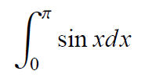

## 第4回
<h1>プログラミング勉強会</h1>

2014年6月12日
担当: koturn


## 目次

- マルチコアを活用する
  - OpenMP
  - TBB
- SIMD
  - CPUレベルでのSIMD化
  - GPUレベルでのSIMD化
    - CUDA
    - OpenCL
- マシン間の分散処理
  - OpenMPI


## 様々な並列化手法

- 並列化は様々なものがある
  - 複数のCPUを用いるもの
    - マルチスレッド
    - マルチプロセス
  - 計算のベクトル化を行うもの
    - CPUの特殊なレジスタ
    - GPGPU


## マルチスレッドの機構

- 古典的なAPI
  - pthread
  - Win32API
- 近代的API
  - OpenMP
    - 標準化されている
    - gcc/g++, MSVCで利用可能
  - TBB
    - APIが言語仕様に沿っている
    - 性能がよい
  - CilkPlus
    - Intel C++ Conpiler のみ


## 古典的な並列化APIと近代的な並列化API

- 古典的な並列化API
  - 低レイヤで汎用性が無い
  - コードが複雑
  - パフォーマンスは出る
- 近代的な並列化API
  - マルチプラットフォーム
  - 洗練されたAPI


## pthread

- POSIXのマルチスレッド機構
  - POSIX Thread
  - 主にLinux環境
    - Windows用の実装も存在する


## POSIXとは

- Portable Operating System Interface
  - 末尾のXはUNIX/Linuxに関連づけてつけられた
- 各種UNIX OSを始めとする異なるOS実装に共通のAPIを定義
  - 移植性の向上を目的
- 規格の内容
  - システムコール
  - プロセス環境
  - ファイルとディレクトリ
  - システムデータベース
  - tarアーカイブフォーマットなど


## WIn32/Win64 API

- WindowsのAPIでもマルチスレッド機構は用意されている
  - 当然Linuxでは利用できない


## WIn32/Win64 API (1)

スレッド関数群(`<process.h>`)

関数名         |   特徴
---------------|-----------------------------------------------------
_beginthread   | スレッドハンドルは自動で閉じる
_beginthreadEx | スレッドハンドルは自分で閉じる必要があるが，一番安全


## WIn32/Win64 API (2)

スレッド関数群(`<windows.h>`)

関数名         |   特徴
---------------|-------------------------------------------------
CreateThread   | スレッド関数内でランタイム関数を用いてはならない
CloseHandle    | スレッドハンドルを閉じるのに用いる


## 各スレッド生成関数の比較

- `_beginthread()`
  - 自動でハンドルを閉じる
  - 予期せぬタイミングでハンドルが閉じられることも
- `_beginthreadex()`
  - 手動でハンドルを閉じる必要がある
  - 一番安全
- `CreateThread()`
  - 手動でハンドルを閉じる必要がある
  - スレッド関数内でCランタイム関数を用いると，メモリリークが発生する


## OpenMP

- 標準化されたマルチスレッド機構
  - gcc, MSVCで利用可能
- 主にpragmaリージョンで簡単に記述可能
  - 非対応の場合，pragmaは無視されるので，非並列版とコードの共用が可能
  - 補助機構として，関数も提供されている
- 既存のコードをほとんど変更することなく，並列化可能
  - 並列化コードを非並列コードとして利用することもできる
- **OpenMPI**とは何の関係も無い
  - **OpenMP**はMulti Process
  - **OpenMPI**はMessage Passing Interface


## OpenMP: 簡単なサンプル

- 簡単なサンプルを例にとる

mptest.c

```c
#include <stdio.h>

int main(void) {
  int i;
  #pragma omp parallel for
  for (i = 0; i < 10000; i++) {
    printf("%05d: Hello World!\n");
  }
  return 0;
}
```


## OpenMP: サンプルのコンパイル (gcc/g++)

- コンパイル時に -fopenmp を付加する必要がある

```sh
$ gcc -c -fopenmp mptest.c -o mptest.o
$ gcc -fopenmp mptest.o -o mptest.out
```


## OpenMP: サンプルのコンパイル (cl.exe)

- コンパイル時に /fopenmp を付加する必要がある
- Visual Studio 2010以前のExpress EditionにOpenMPは含まれない
  - 2012以降なら含まれる

```sh
$ cl.exe -c /openmp mptest.c
$ cl.exe mptest.obj /openmp
```


## ループ並列化の制限

- 実行時に何回のループするか，明示的にわかる必要がある
  - 各コアにループを等分するため
- 以下は誤り

```cpp
#pragma omp parallel for
for (int i = 0; i < 10000; i++) {
  printf("Hello: %d\n", i++);
}
```


## ループ並列化の制限

- std::vectorのループ並列を実現するためには，iteratorを用いてはならない
  - ループ回数が判定できないため

NG

```cpp
int sum = 0;
#pragma omp parallel for
for (std::vector<int>::const_iterator itr = vct.begin(); itr != vct.end(); ++itr) {
  sum += *itr;
}
```

OK

```cpp
int sum = 0;
int size = vct.size();
#pragma omp parallel for
for (int i = 0; i < size; i++) {
  sum += vct[i];
}
```


## アトミック操作 (1)

- データ操作にはアトミック性を確保しなくてはならない
  - リダクション演算など
- OpenMPでの書き方
  - `#pragma omp critical`
    - 直後の一文は一度に1スレッドしか実行できないようにする
  - `#pragma omp atomic`
    - 直後の変数更新の一文に対するアトミック性の確保
    - `#pragma omp critical` より性能面で良い
  - reduction指示節
    - リダクション演算を行う変数を指定


## アトミック操作 (2)

NG

```c
int i;
double sum = 0.0;
#pragma omp pararrel for
for (i = 0; i < 100; i++) {
  sum += array[i];
}
```

OK

```c
int i;
double sum = 0.0;
#pragma omp pararrel for reduction(+:sum)
for (i = 0; i < 100; i++) {
  sum += array[i];
}
```


## 多重ループの並列 (1)

- 多重になっているループは可能な限り，最も外側のループのみを並列化する
  - スレッド生成には時間がかかるため

OK

```cpp
#pragma omp parallel for
for (int i = 0; i < 10000; i++) {
  for (int j = 0; j < 10000; j++) {
    // Do something
  }
}
```


## 多重ループの並列 (2)

NG

```cpp
for (int i = 0; i < 10000; i++) {
  #pragma omp parallel for
  for (int j = 0; j < 10000; j++) {
    // Do something
  }
}
```

NG

```cpp
#pragma omp parallel for
for (int i = 0; i < 10000; i++) {
  #pragma omp parallel for
  for (int j = 0; j < 10000; j++) {
    // Do something
  }
}
```


## TBB

- Thread Building Blocks
- 関数単位での並列化
  - 言語仕様に沿った作りになっているといえる
  - 関数オブジェクトやラムダを用いる
    - わかりやすい


## TBBの関数の引数

- `tbb::parallel_for()` と `tbb::parallel_reduce()` の引数

引数             | 機能
-----------------|--------------------------------------------------------
blocked_range    | ループの範囲を示す
関数オブジェクト | ループの本体で並列化処理対象
partitioner      | ループ範囲の分割を担当する．通常はtbb::auto_partitioner


## TBB: parallel_for

関数オブジェクトが実装すべきメソッド等は以下の通り

引数                 | 機能
---------------------|---------------------------
関数呼び出し演算子() | 並列化するタスクを記述する


## TBB: parallel_for サンプル (1)

```cpp
#include <cmath>
#include <stdlib.h>
#include <tbb/tbb.h>

class MyTask {
private:
  double *input;
  double *output;
public:
  MyTask(double *input, double *output) :
    input(input), output(output) {}

  void operator()(int i) const {
    output[i] = std::sqrt(std::sin(input[i]) * std::sin(input[i]) +
                          std::cos(input[i]) * std::cos(input[i]));
  }
};

int main(void) {
  static const int SIZE = 20000000;
  double *input = new double[SIZE];
  for (int i = 0; i < SIZE; i++) {
    input[i] = i;
  }
  double *output = new double[SIZE];
  tbb::parallel_for(0, SIZE, MyTask(input, output));
  return 0;
}
```


## TBB: parallel_for サンプル (2)

ラムダを用いると単純になる

```cpp
#include <cmath>
#include <stdlib.h>
#include <tbb/tbb.h>

int main(void) {
  static const int SIZE = 20000000;

  double *input = new double[SIZE];
  for (int i = 0; i < SIZE; i++) {
    input[i] = i;
  }

  double *output = new double[SIZE];
  tbb::parallel_for(0, SIZE, [&](int i) {
    output[i] = std::sqrt(std::sin(input[i]) * std::sin(input[i]) +
                          std::cos(input[i]) * std::cos(input[i]));
  });
  return 0;
}
```


## TBB: parallel_reduce

関数オブジェクトが実装すべきメソッド等は以下の通り

引数                         | 機能
-----------------------------|-----------------------------
関数呼び出し演算子()         | 並列化するタスクを記述する
分割タスク用のコンストラクタ | 子タスクの生成に用いられる
join()メソッド               | 各子タスクの結果の集計に必要


## TBB: parallel_reduce サンプル (1)

```cpp
#include <cmath>
#include <iostream>
#include <tbb/tbb.h>

class MyTask {
private:
  double *vec01;
  double *vec02;
  double  sum;
public:
  MyTask(double *vec01, double *vec02) :
    vec01(vec01), vec02(vec02), sum(0.0) {}
  // 分割コンストラクタ
  MyTask(MyTask &task, tbb::split) :
    vec01(task.vec01), vec02(task.vec02), sum(0.0) {}
  void operator()(const tbb::blocked_range<int> &r) {
    for (int i = r.begin(); i < r.end(); i++) {
      sum += vec01[i] * vec02[i];
    }
  }
  // TBBが用いる集積用の関数
  void join(const MyTask &subMyTask) {
    sum += subMyTask.sum;
  }
  double getSum(void) const {
    return sum;
  }
};
```


## TBB: parallel_reduce サンプル (2)

main()関数

```cpp
int main(void) {
  static const int SIZE = 20000000;

  double *vec01 = new double[SIZE];
  double *vec02 = new double[SIZE];
  for (int i = 0; i < SIZE; i++) {
    vec01[i] = i;
    vec02[i] = i;
  }

  double *output = new double[SIZE];
  MyTask myTask(vec01, vec02);
  tbb::parallel_reduce(tbb::blocked_range<int>(0, SIZE), myTask);
  std::cout << myTask.getSum() << std::endl;
  return 0;
}
```


## マルチスレッド機構の比較

- ここから以下4つのマルチスレッド機構についてプログラムを見て比較する
  - pthread
  - Win32/Win64 API
  - OpenMP
  - TBB
- 以下の積分を複合シンプソン公式で計算するプログラムを実装する




## 複合シンプソン公式

- 複合シンプソン公式の関数は以下で統一

```cpp
static double
integral(double (*f)(double x), double a, double b, size_t n)
{
  double h = (b - a) / static_cast<double>(n);
  double s1 = 0.0;
  for (std::size_t i = 1; i < n; i += 2) {
    double x = a + static_cast<double>(i) * h;
    s1 += f(x);
  }

  double s2 = 0.0;
  for (std::size_t  i = 2; i < n - 1; i += 2) {
    double x = a + static_cast<double>(i) * h;
    s2 += f(x);
  }
  double sum = (f(a) + s1 * 4 + s2 * 2 + f(b)) * h / 3;
  return sum;
}
```


## pthread: 積分プログラム (1)

- 先頭部分

```cpp
#include <cmath>
#include <pthread.h>
#include <cstdio>
#include <cstdlib>

static void *
threadFunc(void *va_args);

static double
integral(double (*f)(double x), double a, double b, size_t n);

typedef struct {
  double (*f)(double x);
  double a;
  double b;
  size_t n;
  double retval;
} IntegralAttr;

static const int N_THREADS = 4;
static const double RANGE_A = 0.0;
static const double RANGE_B = M_PI;
static const unsigned int N_DIV = 200000000;
```


## pthread: 積分プログラム (2)

- main()関数

```cpp
int main(void) {
  pthread_t threads[N_THREADS];
  IntegralAttr ias[N_THREADS];

  std::printf("single thread answer = %f\n", integral(sin, RANGE_A, RANGE_B, N_DIV));
  double range = (RANGE_B - RANGE_A) / N_THREADS;
  for (int i = 0; i < N_THREADS; i++) {
    IntegralAttr ia = {sin, range * i, range * (i + 1), N_DIV / N_THREADS, 0.0};
    ias[i] = ia;
    if (pthread_create(&threads[i], NULL, threadFunc, &ias[i]) != 0) {
      std::fprintf(stderr, "error: pthread_create thread[%d]\n", i);
      return EXIT_FAILURE;
    }
  }
  double sum = 0.0;
  for (int i = 0; i < N_THREADS; i++) {
    if (pthread_join(threads[i], NULL) != 0) {
      std::fprintf(stderr, "error: pthread_join thread[%d]\n", i);
      return EXIT_FAILURE;
    }
    std::printf("thread[%d].retval = %f\n", i, ias[i].retval);
    sum += ias[i].retval;
  }
  std::printf("answer = %f\n", sum);

  return EXIT_SUCCESS;
}
```


## pthread: 積分プログラム (3)

- スレッドに渡す関数

```cpp
static void *
threadFunc(void *va_args)
{
  IntegralAttr *ia = (IntegralAttr *) va_args;
  ia->retval = integral(ia->f, ia->a, ia->b, ia->n);
  return NULL;
}
```


## Win thread: 積分プログラム (1)

- 先頭部分

```cpp
#ifdef _MSC_VER
#  define _USE_MATH_DEFINES
#endif
#include <cmath>
#include <cstdio>
#include <cstdlib>
#include <process.h>
#include <windows.h>

static const int N_THREADS = 4;
static const double RANGE_A = 0.0;
static const double RANGE_B = M_PI;
static const unsigned int N_DIV = 200000000;

static unsigned int
threadFunc(LPVOID va_args);

static double
integral(double (*f)(double x), double a, double b, size_t n);

typedef struct {
  double (*f)(double x);
  double a;
  double b;
  size_t n;
  double retval;
} IntegralAttr;
```


## Win thread: 積分プログラム (2)

- `main()` 関数

```cpp
int main(void) {
  IntegralAttr ias[N_THREADS];
  HANDLE h_threads[N_THREADS];
  unsigned int thread_ids[N_THREADS];

  std::printf("single thread answer = %f\n", integral(sin, RANGE_A, RANGE_B, N_DIV));

  double range = (RANGE_B - RANGE_A) / N_THREADS;
  for (int i = 0; i < N_THREADS; i++) {
    IntegralAttr ia = {sin, range * i, range * (i + 1), N_DIV / N_THREADS, 0.0};
    ias[i] = ia;
    h_threads[i] = reinterpret_cast<HANDLE>(
        _beginthreadex(NULL, 0, threadFunc, &ias[i], 0, &thread_ids[i]));
  }

  WaitForMultipleObjects(N_THREADS, h_threads, TRUE, INFINITE);
  double sum = 0.0;
  for (int i = 0; i < N_THREADS; i++) {
    sum += ias[i].retval;
    CloseHandle(h_threads[i]);
  }
  std::printf("multi thread answer = %f\n", sum);

  return EXIT_SUCCESS;
}
```


## Win thread: 積分プログラム (3)

- スレッドに渡す関数

```cpp
static unsigned int
threadFunc(LPVOID va_args)
{
  IntegralAttr *ia = (IntegralAttr *) va_args;
  ia->retval = integral(ia->f, ia->a, ia->b, ia->n);
  printf("sub_answer = %f\n", ia->retval);
  return 0;
}
```


## OpenMP: 積分プログラム (1)

先頭部分

```cpp
#include <cmath>
#include <cstdio>
#include <cstdlib>

static double
integral(double (*f)(double x), double a, double b, size_t n);

static const int N_THREADS = 4;
static const double RANGE_A = 0.0;
static const double RANGE_B = M_PI;
static const unsigned int N_DIV = 200000000;
```


## OpenMP: 積分プログラム (2)

main()関数

```cpp
int main(void) {
  std::printf("single thread answer = %f\n", integral(sin, RANGE_A, RANGE_B, N_DIV));
  double range = (RANGE_B - RANGE_A) / N_THREADS;

  double sum = 0.0;
  #pragma omp parallel for reduction(+:sum)
  for (int i = 0; i < N_THREADS; i++) {
    sum += integral(sin, range * i, range * (i + 1), N_DIV / N_THREADS);
  }
  std::printf("answer = %f\n", sum);
  return 0;
}
```


## TBB: 積分プログラム (1)

先頭部分

```cpp
#ifdef _MSC_VER
#  define _USE_MATH_DEFINES
#endif
#include <ctime>
#include <cmath>
#include <iostream>
#include <tbb/blocked_range.h>
#include <tbb/parallel_reduce.h>
#include <tbb/task_scheduler_init.h>
#include <tbb/tick_count.h>

static const int N_THREADS = 4;
static const double RANGE_A = 0.0;
static const double RANGE_B = M_PI;
static const unsigned int N_DIV = 100000000;

static double
integral(double (*f)(double x), double a, double b, size_t n);
```


## TBB: 積分プログラム (2)

タスク定義部分 (1)

```cpp
class MyTask {
private:
  double      (*f)(double x);
  double       a;
  double       b;
  std::size_t  n;
  double       sum;
public:
  MyTask(double (*_f)(double x), double _a, double _b, std::size_t _n) :
    f(_f), a(_a), b(_b), n(_n), sum(0.0)
  {}

  // 分割コンストラクタ
  MyTask(MyTask &task, tbb::split) :
    f(task.f), a(task.a), b(task.b), n(task.n), sum(0.0)
  {}

  // ... (続く)
```


## TBB: 積分プログラム (3)

タスク定義部分 (2)

```cpp
  // サブタスク
  void operator()(const tbb::blocked_range<int> &r) {
    double      range  = (b - a) / N_THREADS;
    double      localA = range * r.begin();
    double      localB = range * r.end();
    std::size_t localN = n / N_THREADS;
    for (int i = r.begin(); i < r.end(); i++) {
      sum += integral(f, localA, localB, localN);
    }
  }

  // TBBが用いる集積用の関数
  void join(const MyTask &subMyTask) {
    sum += subMyTask.sum;
  }

  double getSum(void) const {
    return sum;
  }
};
```


## TBB: 積分プログラム (4)

main()関数

```cpp
int main(void) {
  std::printf("single thread answer = %f\n", integral(sin, RANGE_A, RANGE_B, N_DIV));

  MyTask task(sin, RANGE_A, RANGE_B, N_DIV);
  tbb::task_scheduler_init init;
  tbb::parallel_reduce(tbb::blocked_range<int>(0, N_THREADS),
                       task, tbb::auto_partitioner());
  init.terminate();
  std::printf("answer = %f\n", task.getSum());

  return 0;
}
```


## CPUレベルでのSIMD化

- あるCPUには計算のベクトル化のための特殊命令が用意されている
  - MMX
    - Multi Media eXtensions
    - 64bitレジスタを用いたベクトル計算
  - SSE
    - Streaming SIMD Extensions
    - 128bitレジスタ(XMMレジスタ)を用いたベクトル計算
  - AVX
    - Advanced VectoreXtensions
    - 256bitレジスタ(YMMレジスタ)を用いたベクトル計算
  - AVX512
    - 512bitのレジスタ(ZMMレジスタ)を用いたベクトル計算
- 主にIntel社のCPU
- マルチスレッド/マルチプロセスとの併用可


## ARM CPUのSIMD

- SIMDはIntelのCPUだけのものではない
- ARM CPUでもSIMD命令は用意されている
  - NEON命令
    - 64bit/128bitのレジスタを用いたベクトル計算
  - 64bitのレジスタ: Dレジスタ(Double word register)
  - 128bitのレジスタ: Qレジスタ(Quad word register)


## 実用例

- SSEは行列演算ライブラリEigenにも利用されている
- OpenCVもSSEへの対応を勧めている
- メルセンヌツイスタの改良版にも採用


## コーディング

- アセンブラで記述する必要はない
- C/C++用のAPIが用意されている
  - gcc/g++, clang, MSVCで共通のAPI
  - 組み込み命令なので，インライン化される
- ビットレベルでの思考を必要とする
  - コードがやや複雑に


## CPUを調べる

CPUがSIMD命令に対応しているかどうかを調べる

```c
#include <intrin.h>
#include <stdio.h>

int main(void) {
  int cpuInfo[4];
  int infoType = 1;
  __cpuid(cpuInfo, infoType);

  if (cpuInfo[3] & 0x00800000) printf("support MMX\n");
  if (cpuInfo[3] & 0x02000000) printf("support SSE\n");
  if (cpuInfo[3] & 0x04000000) printf("support SSE2\n");
  if (cpuInfo[2] & 0x00000001) printf("support SSE3\n");
  if (cpuInfo[2] & 0x00080000) printf("support SSE4.1\n");
  if (cpuInfo[2] & 0x00100000) printf("support SSE4.2\n");
  if (cpuInfo[2] & 0x10000000) printf("support AVX\n");
  return 0;
}
```


## SIMD組み込み関数とヘッダファイル (1)

SIMD命令の組み込み関数を使用するには，特定ヘッダファイルをインクルードする必要がある

使用できる機能 | ヘッダファイル
---------------|---------------
SSE            | `mmintrin.h`
SSE2           | `xmmintrin.h`
SSE3           | `pmmintrin.h`
SSEE3          | `tmmintrin.h`
SSE4A          | `ammintrin.h`
SSE4.1         | `smmintrin.h`
SSE4.2         | `nmmintrin.h`
AES暗号化      | `wmmintrin.h`
AVX            | `immintrin.h`
NEON           | `arm_neon.h`


## SIMD組み込み関数とヘッダファイル (2)

- 多数のヘッダファイルをインクルードするのは面倒
  - まとめてインクルードするには

使用できる機能  | ヘッダファイル
----------------|---------------
MSVC            | intrin.h
gcc/g++ for x64 | intrin.h
gcc/g++ for x86 | x86intrin.h


## 注意点: アラインメント (1)

- アラインメントに気をつける必要がある
  - SSEなら16byteアラインメント
  - AVXなら32byteアラインメント
  - 通常の変数は，（現代的な環境なら）4byteアラインメント
- 変数宣言時にアラインメントを指定する必要がある
  - gcc/g++
    - `__attribute__((aligned(16)) int a;`
  - MSVC
    - `__declspec(align(16)) int a;`
  - C++11以降
    - `alignas(16) int a;`
- 指定しないと落ちる関数がある
  - アライメントを考慮しなくていい関数は少し性能が悪い


## 注意点: アラインメント (2)

- アラインメントを考慮してメモリを動的確保するには
  - cl.exeの場合
    - `_aligned_malloc()` 関数でメモリ確保
    - `_aligned_free()` 関数でメモリ解放
  - その他
    - `posix_memalign()` 関数でメモリ確保
    - `free()` 関数でメモリ解放
  - 非推奨
    - Intel CPUのみ
      - `_mm_malloc()` 関数でメモリ確保
      - `_mm_free()` 関数でメモリ解放
    - やや古い？
      - `memalign()` 関数でメモリ確保
      - `free()` 関数でメモリ解放


## 注意点: アラインメント (3)

環境に非依存のアラインメントを考慮した動的確保の関数を定義

```cpp
#ifdef _MSC_VER
#  include <malloc.h>
#else
#  include <stdlib.h>
#endif

static inline void *
alignedMalloc(size_t size, size_t alignment) {
#ifdef _MSC_VER
  return _aligned_malloc(size, alignment)
#else
  void *p;
  return posix_memalign(&p, alignment, size) == 0 ? p : NULL;
#endif
}

static inline void
alignedFree(void *ptr) {
#ifdef _MSC_VER
  _aligned_free(ptr);
#else
  std::free(ptr);
#endif
}
```


## 注意点: アラインメント (4)

使用例

```c
// std::malloc() と同じ要領で利用可能
float *ptr1 = reinterpret_cast<float *>(alignedMalloc(1000 * sizeof(float), sizeof(__m128)));

// 配置newで利用するのもよい
int *ptr1 = new(reinterpret_cast<int *>(alignedMalloc(1000 * sizeof(i), sizeof(__m128i)))) int;

// 解放は std::free() と同じ要領で
alignedFree(ptr1);
alignedFree(ptr2);
```


## アラインメントに関して

アラインメント宣言はマクロ化するとよい

```cpp
#if __cplusplus >= 201103L
#  define ALIGNAS(n)  alignas(n)
#elif defined(_MSC_VER)
#  define ALIGNAS(n)  __declspec(align(n))
#else
#  define ALIGNAS(n)  __attribute__((aligned(n)))
#endif
```

使用例

```c
ALIGNAS(16) char array[65536];
```


## SSE: サンプルコード (1)

以下のドット積のコードをSSE/AVXで書き直す

```cpp
float dotNormal(float *input, float *weight, int n) {
  float sum = 0.0;
  for (int i = 0; i < n; i++) {
    sum += input[i] * weight[i];
  }
  return sum;
}
```


## SSE: サンプルコード (2)

```cpp
float dotSSE(float *input, float *weight, int n) {
  static const int OFFSET = sizeof(__m128) / sizeof(float);  // 16 / 4 == 4
  int rem = n % OFFSET;
  __m128 w, x, u;
  ALIGNAS(sizeof(__m128)) float mm[OFFSET] = {0};
  u = _mm_load_ps(mm);
  for (int i = 0; i < n; i += OFFSET) {
    w = _mm_load_ps(&input[i]);
    x = _mm_load_ps(&weight[i]);
    x = _mm_mul_ps(w, x);
    u = _mm_add_ps(u, x);
  }
  _mm_store_ps(mm, u);

  float sum = 0.0;
  for (int i = 0; i < OFFSET; i++) {
    sum += mm[i];
  }
  for (int i = n - rem; i < n; i++) {
    sum += input[i] * weight[i];
  }
  return sum;
}
```


## AVX: サンプルコード

ドット積のコードをAVXで記述すると

```cpp
float dotAVX(float *input, float *weight, int n) {
  static const std::size_t OFFSET = sizeof(__m256) / sizeof(input[0]);  // 32 / 4 == 8
  int rem = n % OFFSET;
  __m256 w, x, u;
  ALIGNAS(sizeof(__m256)) float mm[OFFSET] = {0};
  u = _mm256_load_ps(mm);
  for (int i = 0; i < n; i += OFFSET) {
    w = _mm256_load_ps(&input[i]);
    x = _mm256_load_ps(&weight[i]);
    x = _mm256_mul_ps(w, x);
    u = _mm256_add_ps(u, x);
  }
  _mm256_store_ps(mm, u);

  float sum = 0.0;
  for (int i = 0; i < OFFSET; i++) {
    sum += mm[i];
  }
  for (int i = n - rem; i < n; i++) {
    sum += input[i] * weight[i];
  }
  return sum;
}
```


## NEON: サンプルコード

```cpp
float dotNeon(float *input, float *weight, int n) {
  static const int OFFSET = sizeof(float32x4_t) / sizeof(float);  // 16 / 4 == 4
  int rem = n % OFFSET;
  float32x4_t w, x, u;
  ALIGNAS(sizeof(float32x4_t)) float mm[OFFSET] = {0};
  u = vld1q_f32(mm);
  for (int i = 0; i < n; i += OFFSET) {
    w = vld1q_f32(&input[i]);
    x = vld1q_f32(&weight[i]);
    x = vmulq_f32(w, x);
    u = vmulq_f32(u, x);
  }
  vst1q_f32(mm, u);

  float sum = 0.0;
  for (int i = 0; i < OFFSET; i++) {
    sum += mm[i];
  }
  for (int i = n - rem; i < n; i++) {
    sum += input[i] * weight[i];
  }
  return sum;
}
```


## SSEとAVXに関して

- SSEとAVXが混在したコードにしない方がよい
  - SSEとAVXの切り替えにオーバーヘッド
  - 切り替えタイミング
    - 128bit/256nitの組み込み命令を混在
    - SSE/AVXのインラインアセンブラの混在
    - SSE/AVX命令にコンパイルされたC/C++の浮動小数点コード
    - 上記を含む関数やライブラリの呼び出し


## 自動ベクトル化

- コンパイラの最適化により，ベクトル化可能な部分は自動的にベクトル化される
  - ただし，単純なものに限る
  - 自動ベクトル化に関しては，コンパイラはあまり賢くない
- 手動でSIMD命令を用いる方がパフォーマンスが高くなる


## GPGPU

- General-Purpose Computing on Graphics Processing Units
  - GPUによる汎目的計算
  - GPUの演算資源を画像処理以外の目的に応用する技術
- グラフィックボードで処理を行う
- 画像処理に特化
  - すなわち，似た処理の繰り返しに特化
  - ベクトル計算を得意とする
- 条件分岐などの複雑なタスクに弱い


## GPGPUのフレームワーク

- CUDA
  - Compute Unified Device Architecture
  - NVIDIA
- OpenCL
  - Open Computing Language
  - ヘテロジニアス環境
    - マルチコアCPU
    - GPU
    - Cellプロセッサ
    - DSP


## GPGPU特有の用語

- ホスト
  - CPU側
  - 通常のプログラミングで制御できる範囲
- デバイス
  - GPU側
  - 特有のプログラミングで制御
- カーネル
  - GPU側で実行させたい処理(関数)


## CUDA

- Compute Unified Device Architecture
- NVIDIAが提供するGPU向けのC/C++の統合開発環境
  - コンパイラやライブラリなどから構成
- NVIDIAのGPUでしか開発/利用できない
  - NVIDIAのGPUは高価
- GPUの性能を限界まで引き出せる
  - OpenCLよりも細かい調整が可能


## CUDA プログラミング

- 開発言語はC/C++を少し拡張したもの
  - 特有のキーワード
- 用いるコンパイラはnvcc
- ソースコードの拡張子は主に`.cu`


## CUDAのコンパイルの仕組み

- nvccコマンドでコンパイラを呼び出す
- nvccは内部で以下のコンパイラをそれぞれ呼び出す
  - フロントエンドコンパイラ
    - CUDA特有の識別子などを処理
      - この点ではQtと似ている
  - バックエンドコンパイラ
    - 通常のC/C++コンパイラ（gcc/g++, cl.exeなど）
    - 普通のC/C++部分のコンパイルに用いる
    - 最終的な実行バイナリの生成を担当


## カーネル関数の制約

- ホストメモリにはアクセスできない
- 戻り値はvoid型でなければならない
- 可変引数は不可
- 再起処理は出来ない
- 静的変数は使えない
- 標準ライブラリ関数は使えない


## 関数の修飾子

- `__global__`
  - デバイスで実行させるカーネル関数
  - ホスト側からのみ呼び出し可能
  - 戻り値はvoid型のみ
- `__device__`
  - デバイス側でのみ呼び出し可能
  - 戻り値はvoid型でなくてもよい
- `__host__`
  - ホスト側でのみ呼び出し可能
  - ホスト側で実行される
    - 通常の関数
  - `__device__` と併用可能
    - ホストとデバイスの双方で利用可能な関数を作成できる
  - `__global__` との併用は不可


## メモリの修飾子

- `__device__`
  - グローバルメモリ領域に確保
  - 全てのスレッドからアクセス可能
  - ホスト側からは読み書きが可能
- `__constant__`
  - コンスタントメモリ領域に確保
  - 全てのスレッドから読み出し可能
- `__shared__`
  - 共有メモリ領域に確保
  - スレッドの実行中はブロック単位で確保
  - ブロック内のスレッドから読み書き可能


## カーネル関数の呼び出し (1)

- `kernelFunc<<<gridDim, blockDim, Sm, Stream>>>(a, b, c);`
  - 少し特殊
  - `<<< >>>` 部分は非型テンプレートのようなものだと解釈すればよい


## カーネル関数の呼び出し (2)

- `<<< >>>` 内の変数の意味は以下の通り
  - gridDim
    - グリッド中のブロック数
  - blockDim
    - ブロック中のスレッド数
  - Sm
    - ブロックあたりに割り当てるシェアードメモリ容量(byte)
    - 省略可
  - Stream
    - ストリームの番号
    - 省略可


## グリッドとブロックとスレッド

- グリッド
  - ブロックをまとめたもの
  - 3次元的にグリッドを管理
    - ただし，z方向のブロック数は1でなければならない
- ブロック
  - スレッドをまとめたもの
  - 3次元的にスレッドを管理
  - 1グリッドのx方向/y方向の最大ブロック数は65535個
    - これを超えるとエラー
- スレッド
  - 1ブロックあたりの最大スレッド数は512


## カーネル関数について (1)

以下の例をもとに説明する

```cpp
__global__ void
vectorAdd(float *z, const float *x, const float *y, int n) {
  int i = blockDim.x * blockIdx.x + threadIdx.x;
  if (i < n) {
    z[i] = x[i] + y[i];
  }
}
```


## カーネル関数について (2)

- `blockIdx` 変数
  - グリッド上で動作しているブロックのインデックス
  - `x` と `y` というメンバを持つ
- `threadIdx` 変数
  - ブロック上で動作しているスレッドのインデックス
  - `x` と `y` と `z` というメンバを持つ
- `gridDim` 変数
  - グリッドの大きさ
  - `x` と `y` というメンバを持つ
- `blockDim` 変数
  - ブロックの大きさ
  - `x` と `y` と `z` というメンバを持つ


## カーネル関数呼び出し部 (1)

例1

```cpp
// 1グリッドのブロック数: (x, y, z) = (256, 1, 1)
// 1ブロックのスレッド数: (x, y, z) = (196, 1, 1)
vectorAdd<<<256, 196>>>(z_dev, x_dev, y_dev, 50000);
```


## カーネル関数中の変数 (1)
  - ブロックのインデックス
    - blockIdx.x: 0 ~ 255
    - blockIdx.y: 0 ~ 1
  - スレッドのインデックス
    - blockIdx.x: 0 ~ 195
    - blockIdx.y: 0 ~ 1
    - blockIdx.z: 0 ~ 1
  - グリッドの大きさ
    - gridDim.x == 256
    - gridDim.y == 1
  - ブロックの大きさ
    - blockDim.x == 196
    - blockDim.y == 1
    - blockDim.z == 1


## カーネル関数呼び出し部 (2)

例2

```cpp
// 1グリッドのブロック数: (x, y, z) = (256, 256, 1)
dim3 gridsPerBlock(256, 256, 1)
// 1ブロックのスレッド数: (x, y, z) = (32, 16, 4)
dim3 threadsPerBlock(32, 16, 4);
// 変数で設定したブロック数，スレッド数を与える
vectorAdd<<<gridsPerBlock, threadsPerBlock>>>(z_dev, x_dev, y_dev, 50000);
```


## カーネル関数中の変数 (2)
  - ブロックのインデックス
    - blockIdx.x: 0 ~ 255
    - blockIdx.y: 0 ~ 255
  - スレッドのインデックス
    - blockIdx.x: 0 ~ 31
    - blockIdx.y: 0 ~ 15
    - blockIdx.z: 0 ~ 3
  - グリッドの大きさ
    - gridDim.x == 256
    - gridDim.y == 256
  - ブロックの大きさ
    - blockDim.x == 32
    - blockDim.y == 16
    - blockDim.z == 4


## dim3変数について

- 以下の3つの宣言は全て同じ動作
  - `dim3 dimA(16, 16, 1);`
  - `dim3 dimB = dim3(16, 16, 1);`
  - `dim3 dimC = make_dim3(16, 16, 1);`

- 引数省略時は1で埋められる
  - `dim3 dimA(16, 16);`
    - (x, y, z) = (16, 16, 1)
  - `dim3 dimA(16);`
    - (x, y, z) = (16, 1, 1)


## スレッド数について

- スレッド数は32の倍数で指定すること
  - 1クロックサイクル毎に32個のCUDAコアが動作するため
  - 32個でないと，処理に無駄ができる


## ホストとデバイスで値をやりとりする方法

- デバイス側にホスト側のメモリを参照させることはできない
  - デバイスのメモリを確保する必要がある
    - `cudaMalloc()` 関数
    - `cudaFree()` 関数
    - `cudaMemset()` 関数
  - ホストのメモリをデバイスに転送
    - `cudaMemcpy()` 関数
- デバイスのメモリをホスト側で参照することはできない
  - デバイスのメモリをホストのメモリに転送する必要がある
    - `cudaMemcpy()` 関数


## CUDA: サンプルプログラム (1)

- ベクトル加算のサンプルを提示する
  - Cuda 6.0におけるサンプル
- 簡潔にするため，エラー処理は省略
  - CUDAの関数はエラーコードを返り値やポインタ引数にセットする仕組みとなっている
  - プログラム中の `errCode` 変数でエラーコードを受け取っている
    - `errCode == cudaSuccess` なら異常無し
    - それ以外の場合は，異常あり
  - 実践ではちゃんと処理すること
    - `cudaGetErrorString()` 関数に `errCode` を与えると，エラーメッセージ
      を取得することができる


## CUDA: サンプルプログラム (2)

カーネル関数の定義

```cpp
__global__ void
vectorAdd(float *z, const float *x, const float *y, int n) {
  int i = blockDim.x * blockIdx.x + threadIdx.x;
  if (i < n) {
    z[i] = x[i] + y[i];
  }
}
```


## CUDA: サンプルプログラム (3)

- ホストプログラム: cudaTest.cu

インクルード等

```cpp
#include <cstdio>
#include <cstring>
#include <ctime>
#include <cuda_runtime.h>

static const int N = 50000;
static const std::size_t SIZE = N * sizeof(float);
static const int THREADS_PER_BLOCK = 256;
static const int BLOCKS_PER_GRID = (N + THREADS_PER_BLOCK - 1) / THREADS_PER_BLOCK;
```


## CUDA: サンプルプログラム (4)

ベクトルを乱数で初期化

```cpp
int main(void) {
  // ホストのメモリを確保
  float *x = reinterpret_cast<float *>(std::malloc(SIZE));
  float *y = reinterpret_cast<float *>(std::malloc(SIZE));
  float *z = reinterpret_cast<float *>(std::malloc(SIZE));

  // 初期化
  std::srand(static_cast<unsigned int>(std::time(NULL)));
  for (std::size_t i = 0; i < N; i++) {
    x[i] = static_cast<float>(rand()) / RAND_MAX;
    y[i] = static_cast<float>(rand()) / RAND_MAX;
  }
  std::memset(z, 0x00, sizeof(float) * N);
```


## CUDA: サンプルプログラム (5)

デバイスのメモリ確保と初期化

```cpp
  // デバイスのメモリを確保
  float *x_dev, *y_dev, *z_dev;
  cudaError_t errCode;
  errCode = cudaMalloc(reinterpret_cast<void **>(&x_dev), SIZE);
  errCode = cudaMalloc(reinterpret_cast<void **>(&y_dev), SIZE);
  errCode = cudaMalloc(reinterpret_cast<void **>(&z_dev), SIZE);

  // ホストのメモリからデバイスのメモリへデータを転送
  errCode = cudaMemcpy(x_dev, x, SIZE, cudaMemcpyHostToDevice);
  errCode = cudaMemcpy(y_dev, y, SIZE, cudaMemcpyHostToDevice);
```


## CUDA: サンプルプログラム (6)

カーネル関数の実行

```cpp
  // カーネル関数の実行
  vectorAdd<<<BLOCKS_PER_GRID, THREADS_PER_BLOCK>>>(z_dev, x_dev, y_dev, N);
  errCode = cudaGetLastError();

  // デバイスのメモリからホストのメモリへデータを転送
  errCode = cudaMemcpy(z, z_dev, SIZE, cudaMemcpyDeviceToHost);

  // 計算結果の確認
  for (int i = 0; i < N; i++) {
    if (std::fabs(x[i] + y[i] - z[i]) > 1.0e-5) {
      std::fprintf(stderr, "Result verification failed at element %d!\n", i);
      std::exit(EXIT_FAILURE);
    }
  }
  std::printf("Test PASSED\n");
```


## CUDA: サンプルプログラム (7)

後始末

```cpp
  // デバイスのメモリ解放
  errCode = cudaFree(x_dev);
  errCode = cudaFree(y_dev);
  errCode = cudaFree(z_dev);

  // ホストのメモリ解放
  std::free(x);
  std::free(y);
  std::free(z);

  // デバイスのリセット
  errCode = cudaDeviceReset();

  std::printf("Done\n");
  return 0;
}
```


## サンプルのコンパイル&実行

- 以下はWindowsでの例
  - バックエンドコンパイラはcl.exe

```sh
> nvcc -c cudaTest.cpp -I"C:/Program Files/NVIDIA GPU Computing Toolkit/CUDA/v6.0/include"  \
  cudaTest.obj

> nvcc cudaTest.obj -o cudaTest.exe

> cudaTest
Test PASSED
Done
```


## OpenCL

- Open Computing Language
- ヘテロジニアス環境を利用した並列コンピューティングのためのクロス
  プラットフォームなフレームワーク
- NVIDIAのGPUでなくとも，開発/利用可能


## OpenCLのSDK

以下は主な提供元

- [NVIDIA GPU Computing SDK](http://developer.nvidia.com/gpu-computing-sdk)
  - Windows, Mac OS, Linux用
- [AMD Accelerated Parallel Processing SDK](http://developer.amd.com/sdks/AMDAPPSDK/Pages/default.aspx)
  - Windows, Linux用
- [Intel OpenCL SDK](http://software.intel.com/en-us/articles/vcsource-tools-opencl-sdk/)
  - Windows, Linux用
- [IBM OpenCL SDK](http://www.alphaworks.ibm.com/tech/opencl)
  - Linux (x86, Power) 用

CUDAをインストールすると，OpenCLもついてくる！


## OpenCLのコーディング

- ホストとデバイス側のコード（カーネル）は別々のファイルに記述
- ホスト
  - 通常のC/C++で記述可能
- デバイス側のコード
  - 拡張されたC言語で記述する
  - 拡張子は一般的に `.cl`


## カーネル関数のソースコードについて

- OpenCL用のC言語で記述する必要がある
  - C99に制限と拡張を加えたもの
    - ポインタ引数は， `__global` ，`__constant` ， `__local` 修飾されたものに限る
    - 引数にポインタのポインタを渡せない
    - C99の可変長配列：フレキシブル配列は使えない
    - 可変引数マクロは使えない
    - 標準ヘッダは使えない
    - 再帰できない
    - 戻り値はvoid型でなければならない
    - `double` は実装されない場合がある
    - `size_t` などの型は利用できない
  - `float2` 型や `float4` 型といったベクトル型が利用可能


## ポインタのアドレス空間修飾子

- `__global`
  - ホストから読み書き可能
- `__constant`
  - 読み取り専用
  - CUDAの `__constant__` と同等
- `__local`
  - CUDAの `__shared__` と同等
- `__private`
  - 省略時はこれが指定されたことになる


## OpenCLのカーネル関数の仕組み

- カーネル関数は実行時に別ファイルからの読み込みになる
- オンラインコンパイル
  - ソースコード(テキスト)を読み込み，実行時にコンパイル
  - 移植性が高い
  - 実行時にコンパイルするので，オーバーヘッド有り
- オフラインコンパイル
  - カーネル関数が記述されたソースコードを予めコンパイル
  - 実行時にコンパイルしたバイナリを読み込む
  - 実行環境毎にコンパイルが必要


## オフラインコンパイルの手順

- 発見できなかった
  - あまり一般的でない？
  - オフラインコンパイルに対応している環境が限られる？


## OpenCLプログラムの処理手順

1. コンテキストの作成( `clCreateContext()` )
2. コンテキストに含まれるデバイス取得( `clGetContextInfo()` )
3. コマンドキューの作成( `clCreateCommandQueue()` )
4. プログラムオブジェクトの作成( `clCreateProgramWithSource()` )
5. カーネルプログラムのビルド( `clBuildProgram()` )
6. カーネルオブジェクトの作成( `clCreateKernel()` )
7. メモリオブジェクトの作成( `clCreateBuffer()` )
8. カーネル引数の設定( `clSetKernelArg()` )，実行( `clEnqueueTask()` )
9. メモリバッファから結果取得( `clEnqueueReadBuffer()` )し，表示


## OpenCL: サンプルプログラム (1)

- ベクトル加算のサンプルを提示する
- 簡潔にするため，エラー処理は省略
  - OpenCLの関数はエラーコードを返り値やポインタ引数にセットする仕組みとなっている
  - プログラム中の `errCode` 変数でエラーコードを受け取っている
    - `errCode == CL_SUCCESS` なら異常無し
    - それ以外の場合は，以上あり
      - OepnCL側で各種異常用のenumを提供している
  - 実践ではちゃんと処理すること


## OpenCL: サンプルプログラム (2)

カーネル: kernel.cl

カーネル関数の定義

```c
__kernel void
vec_add(__global float* z, __global float* x, __global float* y, int n) {
  const int para = 4;
  const int end = (n / para) * para;

  for (int i = 0; i < end; i += para) {
    float4 vtmp = vload4(0, x + i) + vload4(0, y + i);
    vstore4(vtmp, 0, z + i);
  }

  for (int i = end; i < n; i++) {
    z[i] = x[i] + y[i];
  }
}
```


## OpenCL: サンプルプログラム (3)

- ホストプログラム: openclTest.cpp

インクルード等

```cpp
#include <iostream>
#include <cstdio>
#include <cstdlib>
#include <cstring>
#include <ctime>
#include <numeric>

#ifdef __APPLE__
#  include <OpenCL/opencl.h>
#else
#  include <CL/cl.h>
#endif

const std::size_t MAX_SOURCE_SIZE = 0x100000;
const char KERNEL_FILENAME[] = "kernel.cl";
const std::size_t N = 10;
```


## OpenCL: サンプルプログラム (4)

ベクトルを乱数で初期化

```cpp
int main(void) {
  // ホストのメモリを確保
  float *x = reinterpret_cast<float *>(std::malloc(sizeof(float) * N));
  float *y = reinterpret_cast<float *>(std::malloc(sizeof(float) * N));
  float *z = reinterpret_cast<float *>(std::malloc(sizeof(float) * N));

  // 初期化
  std::srand(static_cast<unsigned int>(std::time(NULL)));
  for (std::size_t i = 0; i < N; i++) {
    x[i] = static_cast<float>(rand()) / RAND_MAX;
    y[i] = static_cast<float>(rand()) / RAND_MAX;
  }
  std::memset(z, 0x00, sizeof(float) * N);
```


## OpenCL: サンプルプログラム (5)

カーネルのソースコードを文字列として配列に格納

```cpp
  // カーネルのソースコードを文字列として取得
  std::FILE *fp = std::fopen(KERNEL_FILENAME, "r");
  if (fp == NULL) {
    std::cerr << "Failed to load kernel" << std::endl;
    return -1;
  }
  char *source_str = reinterpret_cast<char *>(std::malloc(MAX_SOURCE_SIZE));
  std::size_t source_size = std::fread(source_str, 1, MAX_SOURCE_SIZE, fp);
  std::fclose(fp);
```


## OpenCL: サンプルプログラム (6)

実行環境情報の取得等

```cpp
  // プラットフォームを取得
  cl_platform_id platform_id;
  cl_uint ret_num_platforms;
  cl_int errCode = clGetPlatformIDs(1, &platform_id, &ret_num_platforms);

  // デバイス情報を取得
  cl_device_id device_id;
  cl_uint ret_num_devices;
  errCode = clGetDeviceIDs(platform_id, CL_DEVICE_TYPE_DEFAULT, 1, &device_id, &ret_num_devices);

  // コンテキストを生成
  cl_context context = clCreateContext(NULL, 1, &device_id, NULL, NULL, &errCode);

  // コマンドキューを生成
  cl_command_queue command_queue = clCreateCommandQueue(context, device_id, 0, &errCode);
```


## OpenCL: サンプルプログラム (7)

カーネルの準備

```cpp
  // プログラムオブジェクトの生成
  cl_program program = clCreateProgramWithSource(context, 1, const_cast<const char**>(&source_str),
                                                 reinterpret_cast<const size_t*>(&source_size),
                                                 &errCode);

  // カーネルソースコードのコンパイル
  errCode = clBuildProgram(program, 1, &device_id, NULL, NULL, NULL);

  // カーネルオブジェクトの生成
  cl_kernel kernel = clCreateKernel(program, "vec_add", &errCode);
```


## OpenCL: サンプルプログラム (8)

デバイスメモリの確保と初期化

```cpp
  // デバイスが用いるメモリオブジェクトの生成
  cl_mem x_dev = clCreateBuffer(context, CL_MEM_READ_WRITE, N * sizeof(float), NULL, &errCode);
  cl_mem y_dev = clCreateBuffer(context, CL_MEM_READ_WRITE, N * sizeof(float), NULL, &errCode);
  cl_mem z_dev = clCreateBuffer(context, CL_MEM_READ_WRITE, N * sizeof(float), NULL, &errCode);

  // ホストのメモリをデバイスのメモリに転送
  errCode = clEnqueueWriteBuffer(command_queue, x_dev, CL_TRUE, 0, N * sizeof(float),
                                 x, 0, NULL, NULL);
  errCode = clEnqueueWriteBuffer(command_queue, y_dev, CL_TRUE, 0, N * sizeof(float),
                                 y, 0, NULL, NULL);
  errCode = clEnqueueWriteBuffer(command_queue, z_dev, CL_TRUE, 0, N * sizeof(float),
                                 z, 0, NULL, NULL);
```


## OpenCL: サンプルプログラム (9)

カーネル関数の実行

```cpp
  // カーネル関数に引数を渡す
  errCode = clSetKernelArg(kernel, 0, sizeof(cl_mem), &z_dev);
  errCode = clSetKernelArg(kernel, 1, sizeof(cl_mem), &x_dev);
  errCode = clSetKernelArg(kernel, 2, sizeof(cl_mem), &y_dev);
  errCode = clSetKernelArg(kernel, 3, sizeof(int), &N);

  // カーネルプログラムの実行
  errCode = clEnqueueTask(command_queue, kernel, 0, NULL, NULL);

  // 実行結果をデバイスからホストへコピー
  errCode = clEnqueueReadBuffer(command_queue, z_dev, CL_TRUE, 0, N * sizeof(float),
                                z, 0, NULL, NULL);

  // 計算結果の確認
  for (int i = 0; i < N; i++) {
    if (std::fabs(x[i] + y[i] - z[i]) > 1.0e-5) {
      std::fprintf(stderr, "Result verification failed at element %d!\n", i);
      std::exit(EXIT_FAILURE);
    }
  }
  std::printf("Test PASSED\n");
```


## OpenCL: サンプルプログラム (10)

後始末

```cpp
  // OpenCL関連のメモリ解放
  errCode = clReleaseMemObject(x_dev);
  errCode = clReleaseMemObject(y_dev);
  errCode = clReleaseMemObject(z_dev);

  // OpenCL関連のオブジェクトの解放
  errCode = clFlush(command_queue);
  errCode = clFinish(command_queue);
  errCode = clReleaseKernel(kernel);
  errCode = clReleaseProgram(program);
  errCode = clReleaseCommandQueue(command_queue);
  errCode = clReleaseContext(context);

  // ホスト側のメモリ解放
  std::free(x);
  std::free(y);
  std::free(z);
  std::free(source_str);

  return 0;
}
```


## サンプルのコンパイル&実行

Windowsでcl.exeを用いてコンパイルを行う

```sh
> cl.exe /c openclTest.cpp /I"C:/Program Files/NVIDIA GPU Computing Toolkit/CUDA/v6.0/include"

> cl.exe openclTest.obj /link  \
  /LIBPATH:"C:/Program Files/NVIDIA GPU Computing Toolkit/CUDA/v6.0/lib/x64"  \
  OpenCL.lib

> set PATH=%PATH%;C:\Program Files\NVIDIA Corporation\OpenCL

> openclTest
Test PASSED
Done
```


## CUDAのまとめ

- 独自の拡張言語
  - C/C++の仕様から逸れており，やや習熟するのに時間を要する
- OpenCLほど，実行準備のオーバーヘッドが無い
- カーネル関数中の `blockIdx` や `threadIdx` といったグローバル変数
  - やや抵抗がある
- メジャーバージョンの変化毎に大きな仕様の変化
  - 過去のソースコードとあまり互換性がない


## OpenCLのまとめ (1)
- ホストのコードとカーネルのコードを分離可能
  - ホスト側は言語仕様に沿っており，理解しやすい
    - ホスト: C/C++
    - カーネル: 拡張されたC言語
- オフラインコンパイルのオーバーヘッドが大きい
  - オンラインコンパイルでも，カーネルの読み込みという作業がある
- カーネルの読み込みが必要な点がダサい
  - 文字列，バイナリの配列として渡す点
  - カーネルと一体にした実行バイナリが作成できれば...


## OpenCLのまとめ (2)

- カーネル関数のコンパイルに失敗したことに気がつきにくい
  - 失敗した場合，カーネル関数が実行されないだけ
  - プログラムが落ちることはない
  - エラーチェックが必要
- 仕様が大きく変化することはないと思われる


## 参考文献 (1)

- pthread 関連
  - [マルチスレッド大好き](http://www.geocities.jp/debu0510/personal/kusosure.html)
  - [Pthreadプログラミング(1) 新しいスレッドを作成する](http://www.geocities.jp/woodwood77777/linux_c_pthread01.htm)
- Win thread 関連
  - [CreateThread: スレッドを作成する | hm-lab](http://www.hm-lab.net/archives/241)
  - [マルチスレッド](http://www.katto.comm.waseda.ac.jp/~katto/Class/GazoTokuron/code/thread.html)


## 参考文献 (2)

- OpenMP関連
  - [C言語によるOepnMP入門](http://www.cc.u-tokyo.ac.jp/support/kosyu/03/kosyu-openmp_c.pdf)
  - [C++ 開発者が陥りやすい OpenMP* の 32 の罠 | iSUS](http://www.isus.jp/article/openmp-special/32-openmp-traps/)
- TBB関連
  - [parallel_reduce テンプレート関数](http://www.xlsoft.com/jp/products/intel/perflib/tbb/41/tbb_userguide_lnx/reference/algorithms/parallel_reduce_func.htm)
  - [インテルTBBの同期メカニズム](http://codezine.jp/article/detail/6090?p=1)


## 参考文献 (3)

- SSE/AVX/NEON関連
  - [さかな前線 &raquo; SSEとAVXで高次元ベクトルの内積計算を高速化してみた](http://daily.belltail.jp/?p=1520)
  - [SSE.浮動小数点演算手動最適化は本当に効果的なのか - デー](http://ultraist.hatenablog.com/entry/20080622/1214101497)
  - [SIMD演算 - MUGI COM](http://d.hatena.ne.jp/komugi_com/20080323/1206249192)
  - [概要: ストリーミング SIMD 拡張命令](http://wwweic.eri.u-tokyo.ac.jp/computer/manual/altix/compile/CC/Intel_Cdoc91/main_cls/mergedProjects/intref_cls/common/intref_sse_overview.htm)
  - [x86/x64 SIMD命令一覧表　（SSE～AVX2）](http://www.officedaytime.com/tips/simd.html)
  - [ARM NEON Intrinsics - Using the GNU Compiler Collection (GCC)](https://gcc.gnu.org/onlinedocs/gcc-4.8.1/gcc/ARM-NEON-Intrinsics.html)
  - [ARM NEON Development](http://www.add.ece.ufl.edu/4924/docs/arm/ARM%20NEON%20Development.pdf)
  - [SIMD Assembly Tutorial: ARM NEON](https://people.xiph.org/~tterribe/daala/neon_tutorial.pdf)
  - [NEON を使用して Zynq-7000 AP SoC でのソフトウェア性能を向上](http://japan.xilinx.com/support/documentation/application_notes/j_xapp1206-boost-sw-performance-zynq7soc-w-neon.pdf)
  - [ARM gcc バッドノウハウ集](http://jr0bak.homelinux.net/~imai/linux/arm_gcc_badknowhow/arm_gcc_badknowhow.pdf)


## 参考文献 (4)

- CUDA関連
  - [第7回 CUDAプログラミングモデル2 G-DEP](http://www.gdep.jp/page/view/254)
  - [CUDAプログラミング入門](http://accc.riken.jp/secure/4467/cuda-programming_main.pdf)
  - [CUDA::基本編03 - OpenGL de プログラミング](http://seesaawiki.jp/w/mikk_ni3_92/d/CUDA%3A%3A%B4%F0%CB%DC%CA%D403)
  - [CUDA 文法 2 - CUDA Information Site](http://gpu.fixstars.com/index.php/CUDA_%E6%96%87%E6%B3%95_2)
  - [カーネルの実行](http://oshiro.bpe.es.osaka-u.ac.jp/people/staff/imura/OpenGL/CUDA/cuda_exec_kernel/disp_content)
  - [[CUDA] nvcc 使用法 | FX FROG](http://www.fxfrog.com/archives/3755)


## 参考文献 (5)

- OpenCL関連
  - [OpenCLと共通コード (1) 基礎編](http://suchix.kek.jp/bridge/Lattice-code/101203/matsufuru_101203.pdf)
  - [4.7 OpenCL](http://www.e-em.co.jp/OpenFDTD/chap4_7.htm)
  - [失った時を数えて: OpenCLによるGPGPU入門 1](http://the-united-front.blogspot.jp/2014/05/openclgpgpu_23.html)
  - [OpenCLの簡単なプログラム｜Thanksgiving days to hang out（←旧ときどき日記）](http://ameblo.jp/whitena/entry-11280581111.html)
  - [openclの基礎 - Bridge](http://www7303ui.sakura.ne.jp/dokuwiki/doku.php?id=opencl%E3%81%AE%E5%9F%BA%E7%A4%8E)
  - [OpenCL でベクタ演算 (SIMD) を試してみる - その1 - - kawa0810 のブログ](http://kawa0810.hateblo.jp/entry/20130504/1367652096)
  - [clGetDeviceInfo - Tommy6](http://wiki.tommy6.net/wiki/clGetDeviceInfo)
  - [OpenCL編02_2 - OpenGL de プログラミング](http://seesaawiki.jp/w/mikk_ni3_92/d/OpenCL%CA%D402_2)
